---
## Front matter
title: "Отчёт по лабораторной работе №1"
subtitle: "Установка и настройка ОС Fedora на VirtualBox"
author: "Кононов Алексей Сергеевич"

## Generic otions
lang: ru-RU
toc-title: "Содержание"

## Bibliography
bibliography: bib/cite.bib
csl: pandoc/csl/gost-r-7-0-5-2008-numeric.csl

## Pdf output format
toc: true # Table of contents
toc-depth: 2
lof: true # List of figures
lot: false # List of tables
fontsize: 12pt
linestretch: 1.5
papersize: a4
documentclass: scrreprt
## I18n polyglossia
polyglossia-lang:
  name: russian
  options:
	  - spelling=modern
	  - babelshorthands=true
polyglossia-otherlangs:
  name: english
## I18n babel
babel-lang: russian
babel-otherlangs: english
## Fonts
mainfont: PT Serif
romanfont: PT Serif
sansfont: PT Sans
monofont: PT Mono
mainfontoptions: Ligatures=TeX
romanfontoptions: Ligatures=TeX
sansfontoptions: Ligatures=TeX,Scale=MatchLowercase
monofontoptions: Scale=MatchLowercase,Scale=0.9
## Biblatex
biblatex: true
biblio-style: "gost-numeric"
biblatexoptions:
  - parentracker=true
  - backend=biber
  - hyperref=auto
  - language=auto
  - autolang=other*
  - citestyle=gost-numeric
## Pandoc-crossref LaTeX customization
figureTitle: "Рис."
tableTitle: "Таблица"
listingTitle: "Листинг"
lofTitle: "Список иллюстраций"
lotTitle: "Список таблиц"
lolTitle: "Листинги"
## Misc options
indent: true
header-includes:
  - \usepackage{indentfirst}
  - \usepackage{float} # keep figures where there are in the text
  - \floatplacement{figure}{H} # keep figures where there are in the text
---

# Цель работы

Целью данной работы является приобретение практических навыков установки операционной системы на виртуальную машину, настройки 
минимально необходимых для дальнейшей работы сервисов.

# Задание

1. Настроить VirtualBox
2. Установить ОС Fedora
3. Выполнить настройку системы
4. Установить необходимые для создания отчетов пакеты
5. Выполнить домашнее задание

# Теоретическое введение

**Операционная система** — программное обеспечение, управляющее компьютерами (включая микроконтроллеры) и позволяющее запускать на них прикладные программы. Предоставляет программный интерфейс для взаимодействия с компьютером, управляет прикладными программами и занимается распределением предоставляемых ресурсов, в том числе между прикладными программами.

**Виртуальная машина** - программа, эмулирующая аппаратное обеспечение компьютера и исполняющая программы для гостевой платформы
на хост платформе.

# Выполнение лабораторной работы

## Конфигурация виртуальной машины

Запустим VirtualBox. Мы увидим окно менеджера виртуальных машин (рис. [-@fig:01]).
Нажмем кнопку создать. 

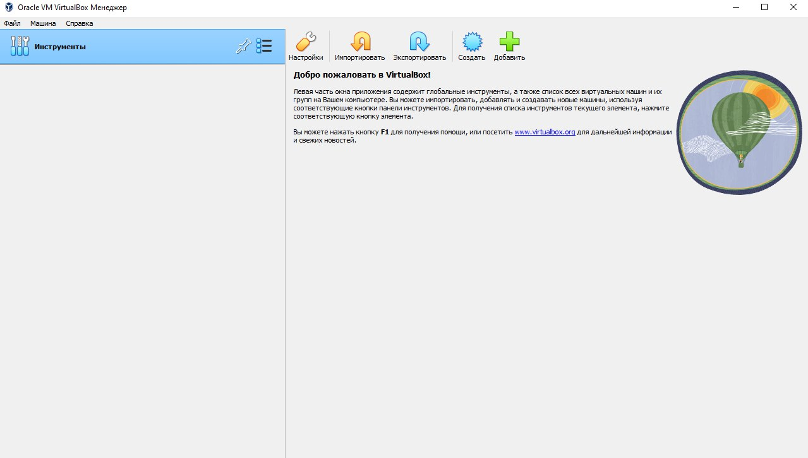{#fig:01}

В появившемся окне (рис. [-@fig:02]) укажем все необходимое в
соответствии с соглашением об именовании и требованиями работы системы.

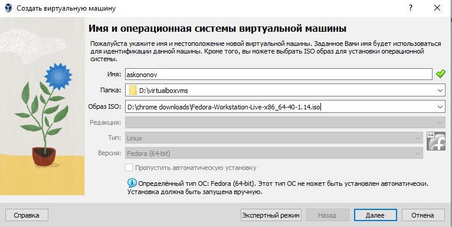{#fig:02}

## Установка ОС Fedora

После запуска виртуальной машины видим меню загрузчика GRUB.
Из предложенных вариантов выберем **Start Fedora-Workstation-Live 40** (рис. [-@fig:03]).

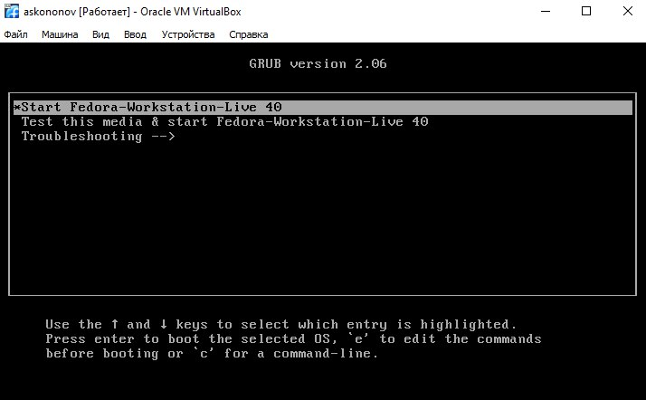{#fig:03}

Начнем установку ОС Fedora нажав на кнопку **Install Fedora**.(рис. [-@fig:04]), 

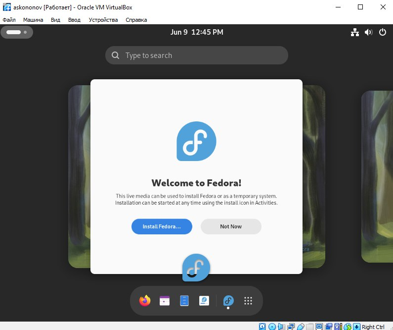{#fig:04}

После установки ОС выключаем виртуальную машину и изымаем ISO диск из привода.
Еще раз запускаем систему.

При установке у нас не спросили имя хоста. 
Зайдем в настройки системы во вкладку "О системе" и зададим его.

## Установка пакетов и автоматическое обновление

Запустим терминал, перейдем в режим суперпользователя введя команду `sudo -i`{.bash}, обновим пакеты используя
команду `dnf update`{.bash} (рис. [-@fig:05]). Для более комфортной работы в терминале установим tmux и mc,
используя команду `dnf -y install tmux mc`{.bash} и включим автоматическое обновление `dnf install dnf-automatic`{.bash} (рис. [-@fig:06]).

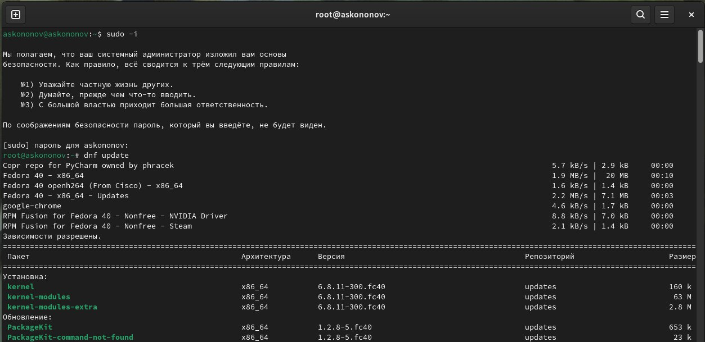{#fig:05}

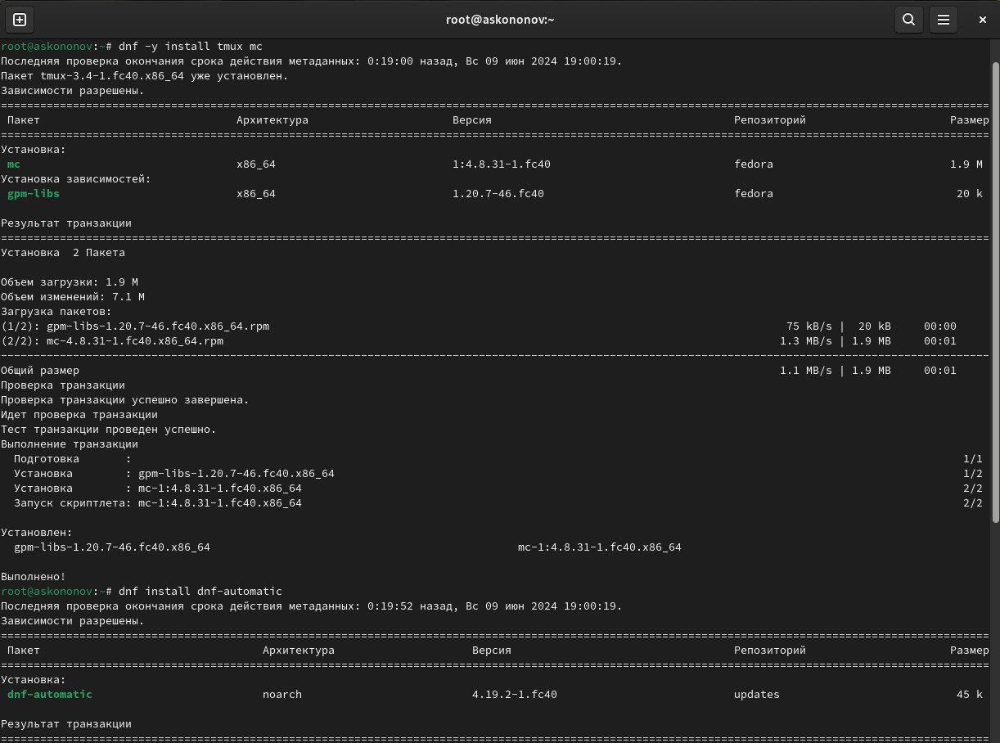{#fig:06}

## Отключение SELinux

С помощью установленного ранее VIM и перейдя в каталог `/etc/selinux/`{.bash} откроем файл `config`{.bash}. Изменим значение константы `SELINUX`{.bash} с `enforcing`{.bash} на `permissive`{.bash} (рис. [-@fig:07]).
Выйдя из VIM перезапустим машину введя команду `reboot`{.bash}.

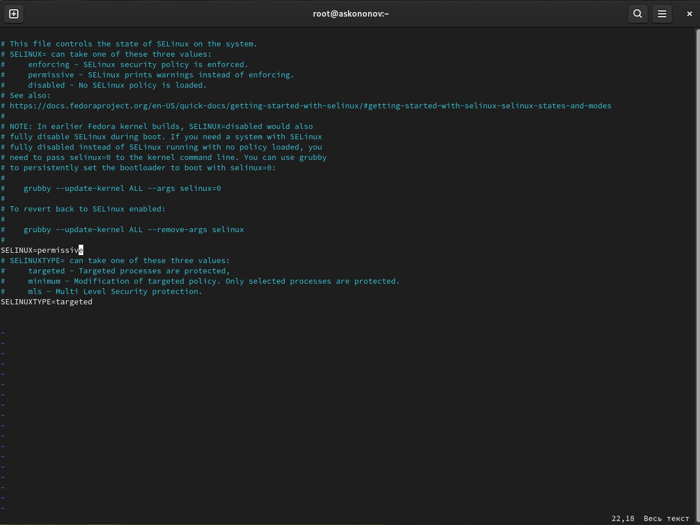{#fig:07}

## Установка dkms

После перезагрузки системы снова откроем терминал, запустим терминальный мультиплексор
командой `tmux`{.bash}. Снова перейдем в режим суперпользователя и установим `dkms`{.bash} (рис. [-@fig:08]).

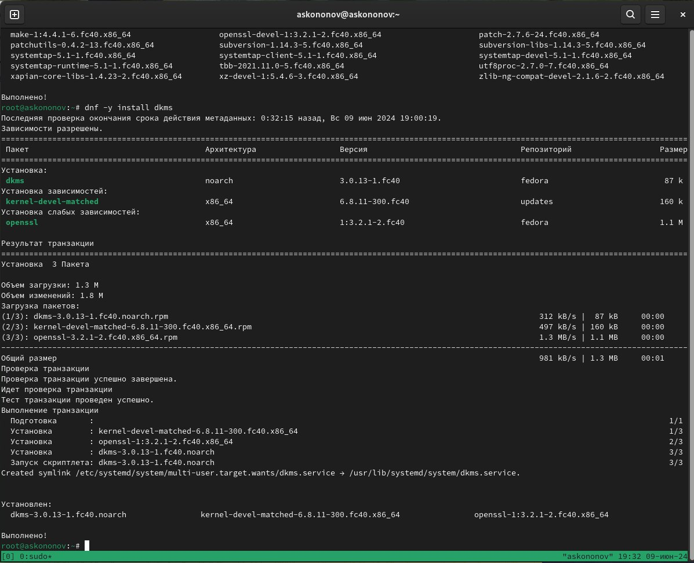{#fig:08}

## Установка программного обеспечения для создания документации

Установим пакеты `pandoc` и `texlive` (рис. [-@fig:09;-@fig:10]).

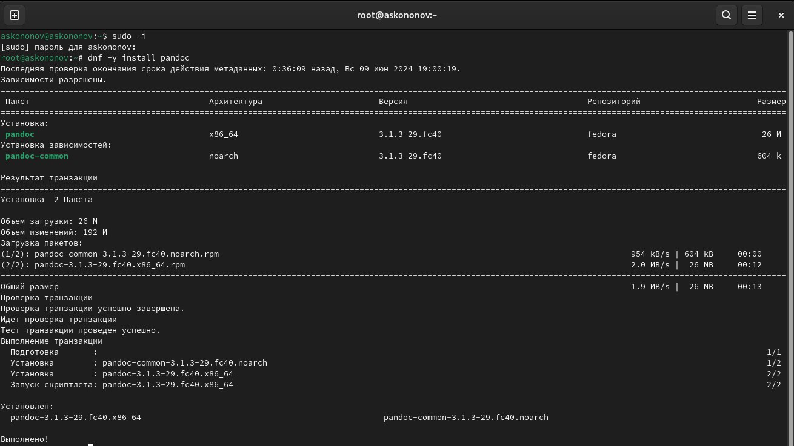{#fig:09}

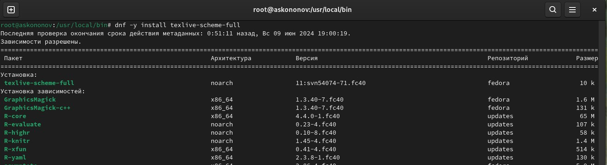{#fig:10}

Установим подходящую версию `pandoc-crossref`{.bash}
[в github репозитории (это ссылка)](https://github.com/lierdakil/pandoc-crossref/releases) 
Скачиваем архив `wget <адрес>`{.bash} распакуем архив в директорию `/usr/local/bin`{.bash}
(рис. [-@fig:11]).

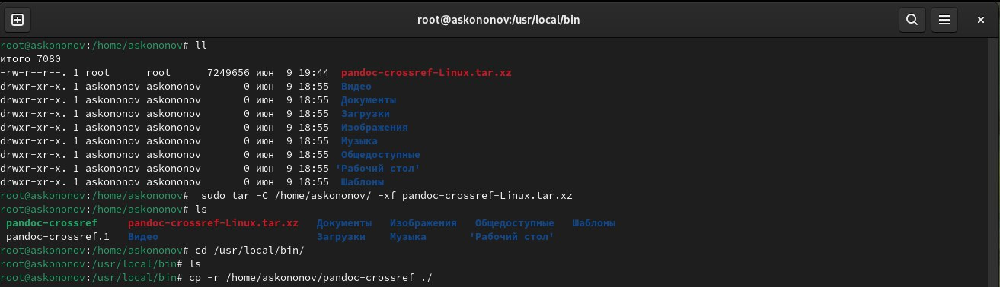{#fig:11}

Установим шрифты переместив в папку `/usr/share/fonts`{.bash}. (рис. [-@fig:12]).

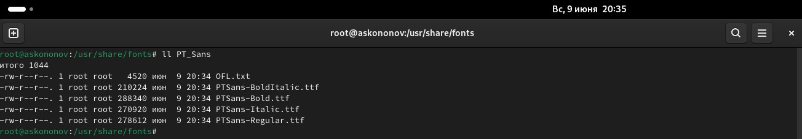{#fig:12}

# Выполнение домашнего задания

Команда `dmesg`{.bash} выводит логи загрузки системы, она должна вызываться с
правами супер пользователя. Первым делом в `dmesg`{.bash} попадают сообщения
о загрузке ядра ОС в память компьютера. А также сообщения о загрузке драйверов для
соответствующего оборудования [@wiki_dmesg]. Часть вывода `dmesg`{.bash} приведена на рис. [-@fig:13].

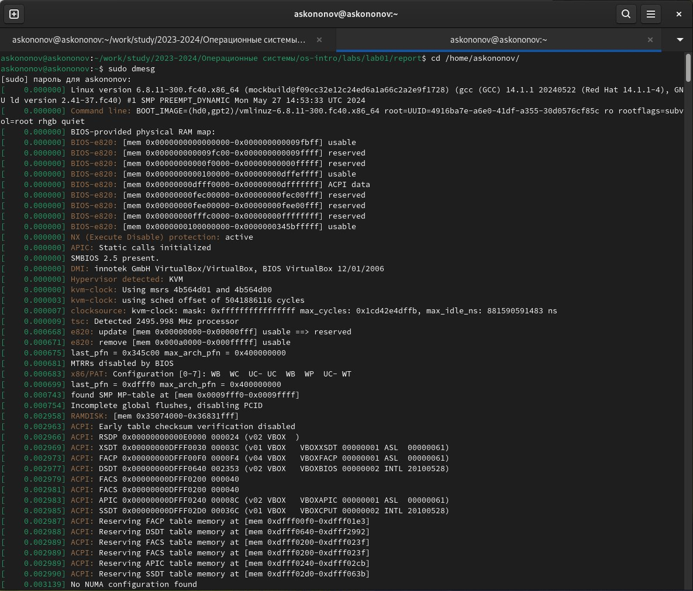{#fig:13}

Получим следующую информацию:

1. Версия ядра Linux
2. Частота процессора
3. Модель процессора
4. Объем доступной оперативной памяти
5. Тип обнаруженного гипервизора
6. Тип файловой системы корневого раздела
7. Последовательность монтирования файловых систем

Полученную для пунктов 1-7 инофрмацию можно увидеть на рис. [-@fig:14].

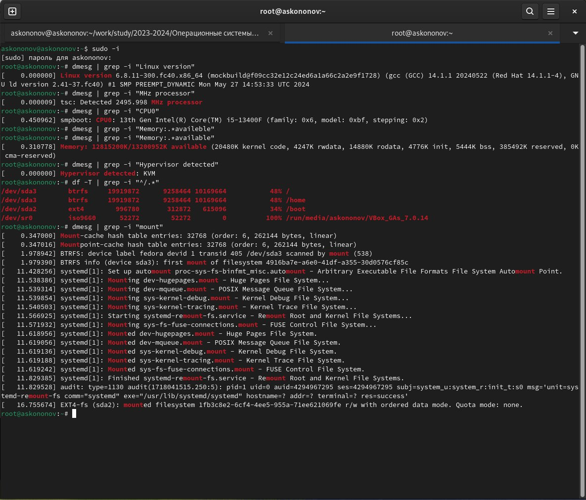{#fig:14}

# Контрольные вопросы

1. **Какую информацию содержит учётная запись пользователя?**

Информацию об учетных записях Linux хранит в файле **/etc /passwd**.
    
Он содержит следующее:

**User ID** - логин;

**Password** – наличие пароля;

**UID** - идентификатор пользователя;

**GID** - идентификатор группы по умолчанию;

**User Info** – вспомогательная информация о пользователе (полное имя, контакты и т.д.)

**Home Dir** - начальный (он же домашний) каталог;

**Shell** - регистрационная оболочка, или shell.

2. **Укажите команды терминала и приведите примеры.**

* для получения справки по команде;
 
Для получения справки по команде используется команда "**man**" (от "manual"). Например, man ls

* для перемещения по файловой системе;
    
Для перемещения по файловой системе используется команда "**cd**" (от "change directory"). Например, cd /home/user/documents

* для просмотра содержимого каталога;
        
Для просмотра содержимого каталога используется команда "**ls**" (от "list"). Например, ls /home/user/documents

* для определения объёма каталога;
        
Для определения объёма каталога используется команда "**du**" (от "disk usage"). Например, du -h /path/to/directory

* для создания / удаления каталогов / файлов;
        
Для создания каталогов используется команда "**mkdir**" (от "make directory"), для удаления - "rmdir" (для удаления пустого каталога) или "rm" (для удаления файлов). Например, mkdir new_directory

* для задания определённых прав на файл / каталог;
        
Для задания определённых прав на файл / каталог используется команда "**chmod**" (от "change mode"). Например, chmod 755 file.txt

* для просмотра истории команд.
        
Для просмотра истории команд используется команда "**history**". Например, history

3. **Что такое файловая система? Приведите примеры с краткой характеристикой.**

Файловая система — это способ организации и хранения файлов на компьютере. Она определяет структуру файлов и директорий, права доступа к ним, их названия и другие свойства.
    
Примеры файловых систем в Linux:

**ext4** - одна из наиболее распространенных файловых систем в Linux. Она обладает высокой производительностью и поддерживает большие объемы данных.

**Btrfs** - современная файловая система, которая поддерживает различные функции, такие как снимки, управление памятью и проверка целостности данных.

**XFS** - файловая система, разработанная для обработки больших объемов данных и высоких нагрузок. Она обладает хорошей производительностью и отказоустойчивостью.

**ZFS** - файловая система с мощными функциями управления данными, включая сжатие, шифрование и быструю проверку целостности данных.

4. Как посмотреть, какие файловые системы подмонтированы в ОС?

В Linux можно просмотреть список подмонтированных файловых систем с помощью команды **df -h**. Эта команда отобразит информацию о дисковом пространстве, включая подмонтированные файловые системы. Также можно использовать команду **mount**, которая отобразит список всех подмонтированных файловых систем и их параметры.
    
5. **Как удалить зависший процесс?**

Для удаления зависшего процесса в Linux можно воспользоваться командой **kill**. Сначала необходимо определить PID (идентификатор процесса) зависшего процесса с помощью команды **ps -aux | grep [название процесса]**. Затем используйте команду **kill [PID]** для завершения процесса. Если процесс по-прежнему не завершается, можно попробовать использовать команду **kill -9 [PID]**, которая немедленно прерывает процесс. Также можно воспользоваться командой **pkill [название процесса]** для завершения всех процессов с указанным именем.

# Выводы

В данной работе мы приобрели практические навыки установки операционной системы на виртуальную машину и настройки минимально необходимых для дальнейшей работы сервисов.

# Список литературы{.unnumbered}

1. Кулябов Д. С. Введение в операционную систему UNIX – Лекция.
 
2. Colvin H. VirtualBox: An Ultimate Guide Book on Virtualization with VirtualBox. — CreateSpace Independent Publishing Platform, 2015. — 70 с.
 
3. Таненбаум Э., Бос Х. Современные операционные системы. — 4-е изд. — СПб. : Питер, 2015. — 1120 с. — (Классика Computer Science).

