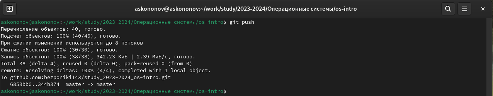

---
## Front matter
title: "Отчёта по лабораторной работе №2:"
subtitle: "Первоначальная настройка git"
author: "Кононов Алексей Сергеевич"

## Generic otions
lang: ru-RU
toc-title: "Содержание"

## Bibliography
bibliography: bib/cite.bib
csl: pandoc/csl/gost-r-7-0-5-2008-numeric.csl

## Pdf output format
toc: true # Table of contents
toc-depth: 2
lof: true # List of figures
fontsize: 12pt
linestretch: 1.5
papersize: a4
documentclass: scrreprt
## I18n polyglossia
polyglossia-lang:
  name: russian
  options:
	- spelling=modern
	- babelshorthands=true
polyglossia-otherlangs:
  name: english
## I18n babel
babel-lang: russian
babel-otherlangs: english
## Fonts
mainfont: PT Serif
romanfont: PT Serif
sansfont: PT Sans
monofont: PT Mono
mainfontoptions: Ligatures=TeX
romanfontoptions: Ligatures=TeX
sansfontoptions: Ligatures=TeX,Scale=MatchLowercase
monofontoptions: Scale=MatchLowercase,Scale=0.9
## Biblatex
biblatex: true
biblio-style: "gost-numeric"
biblatexoptions:
  - parentracker=true
  - backend=biber
  - hyperref=auto
  - language=auto
  - autolang=other*
  - citestyle=gost-numeric
## Pandoc-crossref LaTeX customization
figureTitle: "Рис."
tableTitle: "Таблица"
listingTitle: "Листинг"
lofTitle: "Список иллюстраций"
lolTitle: "Листинги"
## Misc options
indent: true
header-includes:
  - \usepackage{indentfirst}
  - \usepackage{float} # keep figures where there are in the text
  - \floatplacement{figure}{H} # keep figures where there are in the text
---

# Цель работы

Целью данной работы заключается в изучении идеологии и применении средств контроля версий, а также освоить умения по работе с git. 

# Задание

1. Создать базовую конфигурацию для работы с git.
2. Создать ключ SSH.
3. Создать ключ PGP.
4. Настроить подписи git.
5. Зарегистрироваться на Github.
6. Создать локальный каталог для выполнения заданий по предмету.

# Теоретическое введение

Системы контроля версий (Version Control System, VCS) применяются при работе нескольких человек над одним проектом. Обычно основное дерево проекта хранится в локальном или удалённом репозитории, к которому настроен доступ для участников проекта. При внесении изменений в содержание проекта система контроля версий позволяет их фиксировать, совмещать изменения, произведённые разными участниками проекта, производить откат к любой более ранней версии проекта, если это требуется.

# Выполнение лабораторной работы

Установим git **dnf install git** и gh **dnf install gh** (рис. [-@fig:001]).

{#fig:001 width=100%}

Сделаем базовые настройки git. Для этого зададим имя и почту владельца репозитория (**git config --global user.name "Name Surname"** и **git config --global user.email "work@mail**), настроим utf-8 в выводе сообщений git (**git config --global core.quotepath false**), зададим имя начальной ветки, которую будем называть ее master (**git config --global init.defaultBranch master**) и установим пару параметров (**git config --global core.autocrlf input** и **git config --global core.safecrlf warn**). И проверим изменения с помощью команды **git config --list** (рис. [-@fig:003]).
    
{#fig:002 width=100%}

Cоздадим ключ ssh **ssh-keygen -t rsa -b 4096** (рис. [-@fig:003]).
    
{#fig:003 width=100%}

Cгенерируем ключ **pgp** с помощью команды **gpg --full-generate-key**. (рис. [-@fig:004]).

{#fig:004 width=100%}

Буду использовать уже существующую учетную запись (рис. [-@fig:005]).
    
{#fig:005 width=100%}

Выводим список ключей **gpg --list-secret-keys --keyid-format LONG** и копируем опечаток приватного ключа **gpg --armor --export <Отпечаток_ключа> | xclip -sel clip**. (рис. [-@fig:006]) Ключи добавляем на GitHub (**settings --> SSH and GPG keys --> New GPG key**), а также настроим автоматические подписи коммитов git с помощью команд: **git config --global user.signingkey <Отпечаток_ключа>**, **git config --global commit.gpgsign true**, **git config --global gpg.program $(which gpg2)**.
    
{#fig:006 width=100%}

Настраиваем gh **gh auth login** и авторизуемся через браузер (рис. [-@fig:007]), (рис. [-@fig:008]).
    
{#fig:007 width=100%}

{#fig:008 width=100%}

Создадим репозиторий для 2023–2024 учебного года: 

**mkdir -p ~/work/study/2023-2024/"Операционные системы"**

**cd ~/work/study/2023-2024/"Операционные системы"**

**gh repo create study_2023-2024_os-intro --template=yamadharma/course-directory-student-template --public**

**git clone --recursive git@github.com:<owner>/study_2023-2024_os-intro.git os-intro** (рис. [-@fig:009]).
    
{#fig:009 width=100%}

Настроим каталог, удалим лишние файлы **rm package.json**, также создадим еще необходимые каталоги **echo os-intro > COURSE** и **make prepare**, и отправим на сервер **git add .**, **git commit -am 'feat(main): make course structure'**, **git push** (рис. [-@fig:010]), (рис. [-@fig:011]), (рис. [-@fig:012]).

{#fig:010 width=100%}

{#fig:011 width=100%}

{#fig:012 width=100%}

# Контрольные вопросы

1. **Что такое системы контроля версий (VCS) и для решения каких задач они предназначаются?**

Системы контроля версий (Version Control System, VCS) — это программные инструменты, помогающие командам разработчиков управлять изменениями в исходном коде с течением времени. В свете усложнения сред разработки они помогают командам разработчиков работать быстрее и эффективнее.

2. **Объясните следующие понятия VCS и их отношения: хранилище, commit, история, рабочая копия.**

**Хранилище (репозиторий)** — это централизованное место, где хранятся файлы и история изменений проекта. Оно содержит все версии файлов, метаданные и историю коммитов.

**Commit (фиксация)** — это действие по сохранению изменений в системе контроля версий. При коммите разработчик предоставляет описание внесенных изменений, и эти изменения фиксируются в репозитории.

**История (history)** — это список всех коммитов и изменений, связанных с проектом. История содержит информацию о том, кто, когда и какие изменения вносил, и позволяет отслеживать всю историю проекта.

**Рабочая копия (working copy)** — это локальная копия файлов из репозитория, с которой работает разработчик. Рабочая копия содержит текущую версию проекта, и разработчик вносит изменения в нее перед их фиксацией (коммитом) в репозиторий.

3. **Что представляют собой и чем отличаются централизованные и децентрализованные VCS? Приведите примеры VCS каждого вида.**

**Централизованная система контроля версий (Centralized Version Control System, CVS)** история версий хранится на удалённом сервере, а рабочий код на нескольких компьютерах. Компьютеры связаны с одним сервером. Примером может послужить SVN (Subversion).

**Децентрализованные системы контроля версий (Distributed Version Control System, DVCS)** рабочий код хранится на нескольких компьютерах, а история всех версий хранится как на удалённом сервере, так и на каждом из этих компьютеров. Все компьютеры связаны с сервером, но ещё дополнительно связаны между собой. Пример Git.

4. **Опишите действия с VCS при единоличной работе с хранилищем.**

При единоличной работе с хранилищем VCS основными действиями будут:

- **Инициализация репозитория**: создание нового проекта или клонирование существующего репозитория из удаленного источника (например, GitHub).

- **Добавление файлов**: добавление новых файлов в репозиторий или изменение уже существующих файлов.

- **Фиксация изменений**: коммит изменений в репозиторий с указанием описания изменений.

- **Просмотр истории изменений**: просмотр и анализ всех предыдущих коммитов, внесенных в репозиторий.

- **Ветвление**: создание отдельных веток для разработки новых функций или исправлений багов.

- **Объединение изменений**: слияние веток и консолидация изменений в основной ветке разработки.

- **Удаление файлов**: удаление ненужных файлов из репозитория.

- **Удаленная работа**: отправка изменений на удаленный сервер и получение изменений из удаленного репозитория.

5. **Опишите порядок работы с общим хранилищем VCS.**

- **Создание репозитория**: сначала необходимо создать репозиторий на сервере или в облаке, где будет храниться общее хранилище файлов.

- **Клонирование репозитория**: разработчики должны клонировать репозиторий себе на локальную машину, чтобы иметь доступ к файлам и иметь возможность вносить изменения.

- **Работа с файлами**: разработчики могут вносить изменения в файлы на локальной машине, создавать новые файлы, удалять или редактировать существующие.

- **Подготовка к коммиту**: перед сохранением изменений в репозиторий, необходимо подготовить их к коммиту, добавив их в "индекс" при помощи команды git add.

- **Коммит изменений**: после подготовки изменений, разработчики должны сделать коммит, сохраняя все внесенные изменения в историю репозитория при помощи команды git commit.

- **Пуш изменений**: после коммита, изменения могут быть отправлены в общее хранилище с помощью команды git push, что позволит другим разработчикам видеть и получать эти изменения.

- **Обновление локального репозитория**: разработчики могут получить последние изменения из общего хранилища с помощью команды git pull, чтобы обновить свою локальную версию репозитория.

6. **Каковы основные задачи, решаемые инструментальным средством git?**
- Хранить информацию и всех изменениях в коде, с возможностью в любой момент перейти к любому из них.

- Обеспечение удобства командной работы над кодом.

7. **Назовите и дайте краткую характеристику командам git.**

- **git init**: инициализация нового репозитория
- **git add**: добавление изменений в индекс
- **git commit**: сохранение изменений в репозитории
- **git push**: отправка изменений в удаленный репозиторий
- **git pull**: получение изменений из удаленного репозитория
- **git branch**: создание, удаление и просмотр веток
- **git merge**: объединение изменений из другой ветки
- **git checkout**: переключение между ветками

8. **Приведите примеры использования при работе с локальным и удалённым репозиториями.**

**Локальный репозиторий**: создание нового проекта с помощью git init, добавление новых файлов с помощью git add, сохранение изменений в репозитории с помощью git commit.

**Удаленный репозиторий**: отправка изменений из локального репозитория на удаленный с помощью git push, получение изменений из удаленного репозитория с помощью git pull.

9. **Что такое и зачем могут быть нужны ветви (branches)?**

Ветка - параллельный участок истории в одном хранилище, между ветками возможно слияние. Обычно используются для создания новых функций или новых версий приложения.

10. **Как и зачем можно игнорировать некоторые файлы при commit?**

Можно просто не добавлять их в индекс командой git add или создать файл .gitignore, в котором перечислить все файлы и папки которые требуется игнорировать. Может понадобиться игнорировать настройки IDE, или бинарные файлы. Так как они зависят от конкретного разработчика и платформы, и в репозитории они могут быть лишними.

# Выводы

В этой лабораторной работе мы научились настраивать git генерировать ключи для ssh и gpg, а также взаимодействовать с удаленными репозиториями, создавая свои из шаблонов и загружая изменения в локальном репозитории на удаленный.

# Список литературы{.unnumbered}

::: {#refs}
:::

