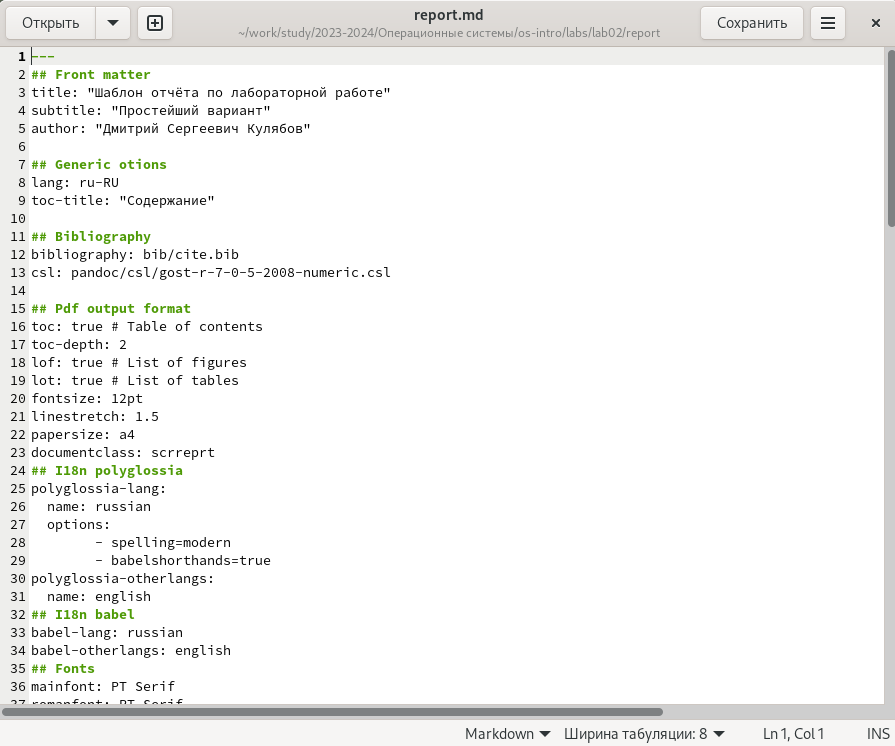
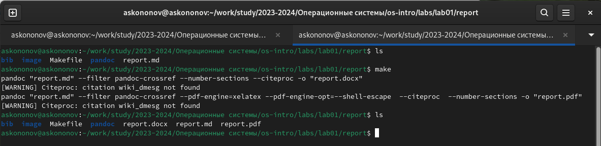
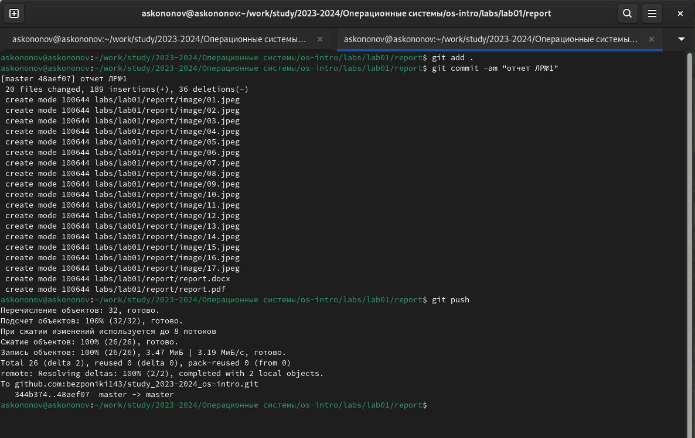

---
## Front matter
title: "Отчёта по лабораторной работе №3:"
subtitle: "Markdown"
author: "Кононов Алексей Сергеевич"

## Generic otions
lang: ru-RU
toc-title: "Содержание"

## Bibliography
bibliography: bib/cite.bib
csl: pandoc/csl/gost-r-7-0-5-2008-numeric.csl

## Pdf output format
toc: true # Table of contents
toc-depth: 2
lof: true # List of figures
fontsize: 12pt
linestretch: 1.5
papersize: a4
documentclass: scrreprt
## I18n polyglossia
polyglossia-lang:
  name: russian
  options:
	- spelling=modern
	- babelshorthands=true
polyglossia-otherlangs:
  name: english
## I18n babel
babel-lang: russian
babel-otherlangs: english
## Fonts
mainfont: PT Serif
romanfont: PT Serif
sansfont: PT Sans
monofont: PT Mono
mainfontoptions: Ligatures=TeX
romanfontoptions: Ligatures=TeX
sansfontoptions: Ligatures=TeX,Scale=MatchLowercase
monofontoptions: Scale=MatchLowercase,Scale=0.9
## Biblatex
biblatex: true
biblio-style: "gost-numeric"
biblatexoptions:
  - parentracker=true
  - backend=biber
  - hyperref=auto
  - language=auto
  - autolang=other*
  - citestyle=gost-numeric
## Pandoc-crossref LaTeX customization
figureTitle: "Рис."
tableTitle: "Таблица"
listingTitle: "Листинг"
lofTitle: "Список иллюстраций"
lolTitle: "Листинги"
## Misc options
indent: true
header-includes:
  - \usepackage{indentfirst}
  - \usepackage{float} # keep figures where there are in the text
  - \floatplacement{figure}{H} # keep figures where there are in the text
---

# Цель работы

Научиться оформлять отчёты с помощью легковесного языка разметки Markdown.

# Задание

1. Ознакомиться с синтаксисом языка разметки Markdown;

2. Узнать, как компилируются отчёты в различных форматах из исходного файла с расширением .md;

3. Сделайте отчёт по предыдущей лабораторной работе в формате Markdown

# Теоретическое введение

**Оформление элементов текста в Markdown:**

- Заголовки:

Чтобы создать заголовок, используем знак #:
  
  ```# Заголовок 1-го уровня, ## Заголовок 2-го уровня, и т.д.```
  
- Тип начертания:
 
Полужирное начертание (** с двух сторон): **ваш текст**
  
Курсивное начертание (* с двух сторон): *ваш текст*
  
Полужирное + курсивное начертание (*** с двух сторон): ***ваш текст***
  
- Цитирование (>):

  ```> Ваша цитата...```
  
- Списки:

Маркированный (неупорядоченный) список (Обозначаем элементы списка тире или звёздочками):
  
  ```
  - пункт 1
  - пункт 2
  - пункт 3
  ```
  
Вложение списков (используем отступы):
  
  ```
  - пункт 1
  	- подпункт 1
  - пункт 2
  	- подпункт 2
  ```
  
Упорядоченный список (используем цифры):
  
  ```
  1. Пункт 1;
  2. Пункт 2;
  3. Пункт 3.
  ```
  
Чтобы вложить один список в другой, также используем отступы.
  
- Синтаксис Markdown для встроенной ссылки состоит из части **[link text]** , представляющей текст гиперссылки, и части **(file-name.md)** – URL-адреса или имени файла, на который дается ссылка:

  ```[link text](file-name.md )```
  
- Оформление кода (код оформляется символами (```) сверху и снизу):

    ``` python
    print('Hello, world!')
    ```
  
- Формулы и их отображение:

Чтобы поставить нижний индекс, используем знак тильды (~):
  
 ```H~2~0``` 
  
Чтобы поставить степень, пишем знак ^ два раза:
  
  ```2^10^```
  
Знакомая нам со школы формула (основное тригонометрическое тождество) будет выглядеть так (заключаем формулу в знаки доллара с двух сторон):

  ```$\sin^2 (x) + \cos^2 (x) = 1$```

- Обработка файлов в формате Markdown (.md):

Для того, чтобы обрабатывать файлы в таком формате, нам понадобится следующее ПО: [Pandoc - официальный сайт](https://pandoc.org/), [pandoc-citeproc](https://github.com/jgm/pandoc/releases) и [Pandoc-crossref](https://github.com/lierdakil/pandoc-crossref/releases). Все эти программы были установлены мною в ходе выполнения лабораторной работы №1.
  
**Преобразовать файл README.md можно следующим образом:**

```
pandoc README.md -o README.pdf
```

Получим файл в формате .pdf, скомпилированный из Markdown. Так же можно скомпилировать и файл в формате .docx.
  
# Выполнение лабораторной работы

Для начала перейдем в каталог с лабораторной работой №2 командой **cd ~/work/study/2023-2024/Операционные системы/os-intro/labs/lab02/report**, затем командой **gedit report.md** откроем файл с отчетом. Если данной команды нет, то ОС сама предложит ее установить(рис. [-@fig:001]).

{#fig:001 width=100%}

Вносим изменения в шаблон, заполнив своими данными: ФИО, номер ЛР, название ЛР. И приступаем непосредственно к отчету по выполненным в ходе ЛР действий и их описанию, используя базовые сведения из теоритической части ЛР №3

После завершения оформления отчета необходимо скомпилировать его с помощью команды **make** (в папке с ЛР есть Makefile, который сам скомпилирует, поэтому вручную писать нет необходимости). Командой **ls** проверяем, появились ли файлы. Если при просмотре новых файлов что-то в них не устраивает, то командой **make clean** можно их удалить, чтоб в дальнейшем скомпилировать заново (рис. [-@fig:002]).
    
{#fig:002 width=100%}

Затем отправляем полученные файлы на GitHub посредством локального репозитория (рис. [-@fig:003]).

{#fig:003 width=100%}

# Выводы

В данной лабораторной работе мы познакомились с синтаксисом и научились оформлять файлы в формате Markdown.

# Список литературы{.unnumbered}

1. Руководство по выполнению лабораторной работы №3, Д.С. Кулябов, Российский Университет Дружбы Народов.

