---
## Front matter
title: "Отчёта по лабораторной работе №4:"
subtitle: "Основы интерфейса взаимодействия пользователя с системой Unix на уровне командной строки"
author: "Кононов Алексей Сергеевич"

## Generic otions
lang: ru-RU
toc-title: "Содержание"

## Bibliography
bibliography: bib/cite.bib
csl: pandoc/csl/gost-r-7-0-5-2008-numeric.csl

## Pdf output format
toc: true # Table of contents
toc-depth: 2
lof: true # List of figures
fontsize: 12pt
linestretch: 1.5
papersize: a4
documentclass: scrreprt
## I18n polyglossia
polyglossia-lang:
  name: russian
  options:
	- spelling=modern
	- babelshorthands=true
polyglossia-otherlangs:
  name: english
## I18n babel
babel-lang: russian
babel-otherlangs: english
## Fonts
mainfont: PT Serif
romanfont: PT Serif
sansfont: PT Sans
monofont: PT Mono
mainfontoptions: Ligatures=TeX
romanfontoptions: Ligatures=TeX
sansfontoptions: Ligatures=TeX,Scale=MatchLowercase
monofontoptions: Scale=MatchLowercase,Scale=0.9
## Biblatex
biblatex: true
biblio-style: "gost-numeric"
biblatexoptions:
  - parentracker=true
  - backend=biber
  - hyperref=auto
  - language=auto
  - autolang=other*
  - citestyle=gost-numeric
## Pandoc-crossref LaTeX customization
figureTitle: "Рис."
tableTitle: "Таблица"
listingTitle: "Листинг"
lofTitle: "Список иллюстраций"
lolTitle: "Листинги"
## Misc options
indent: true
header-includes:
  - \usepackage{indentfirst}
  - \usepackage{float} # keep figures where there are in the text
  - \floatplacement{figure}{H} # keep figures where there are in the text
---

# Цель работы

Приобретение практических навыков взаимодействия пользователя с системой посредством командной строки.

# Задание

1. Определить полное имя домашнего каталога.
2. Выполнить следующие действия:
    1. Перейти в каталог `/tmp`.
    2. Вывести на экран содержимое каталога `/tmp` командой `ls` с различными опциями.\
    Пояснить разницу выводимой информации.
    3. Определить есть ли в каталоге `/var/spool/` подкаталог с именем `cron`.
    4. Перейти в домашний каталог и вывести его содержимое. Определить кто является владельцом файлов и подкаталогов.
3. Выпольнить следующие действия:
    1. В домашнем каталоге создать новый каталог с именем `newdir`.
    2. В каталоге `~/newdir` создать новый каталог с именем `morefun`.
    3. Создать одной командой в домашнем каталоге три новый каталога с именами\
    `letters,memos,misk`. Затем удалить эти каталоги одной командой.
    4. Попробовать удалить ранее созданный каталог `~/newdir` командой `rm`. Проверить был ли удален каталог.
    5. Удалить каталог `~/newdir/morefun` из домашнего каталога. Проверит был ли удален каталог.
4. С помощью команды `man` определить, какую опцию команды `ls` нужно использовать для просмотра не только указаного каталога, но и его подкаталогов.
5. С помощью команды `man` определить набор опций команды `ls`, позволяющий отсортировать по времени последнего изменения выводимый список содержимого каталога развернутым описанием файлов.
6. Использовать команду `man`{.bash} для просмотра описания следующих команд: `cd, pwd, mkdir, rmdir, rm`.
Поясните основные опции этих команд.
7. Используя ифнормацию полученную при помощи команду `history`, выполните модификацию и исполнение нескольких команд из буфера команд.

# Теоретическое введение

В операционной системе типа Linux взаимодействие пользователя с системой обычно осуществляется с помощью командной строки посредством построчного ввода команд. При этом обычно используются командные интерпритаторы языка shell. Такие как `/bin/sh; /bin/csh; /bin/ksh /bin/zsh`,
мы же используем `/bin/bash`.

Общий формат команд можно представить следующим образом: `<имя_команды><разделитель><аргументы>`

Далее в отчете мы подробно рассмотрим и испольуем команды:\
`cd, pwd, ls, mkdir, rmdir, rm` и `man`.

# Выполнение лабораторной работы

1. Для определения каталога где мы находимся используем команду **pwd**. 

2. Перейдем в папку временных файлоов **cd /tmp** и выведем содержимое папки **ls**. В этом случае просто выводится список файлов без какой-либо дополнительной информации о них.
Команда **ls -l** выдает список файлов, а также их владельца, дату последнего изменения (длинный список файлов)(рис. [-@fig:001]).
    
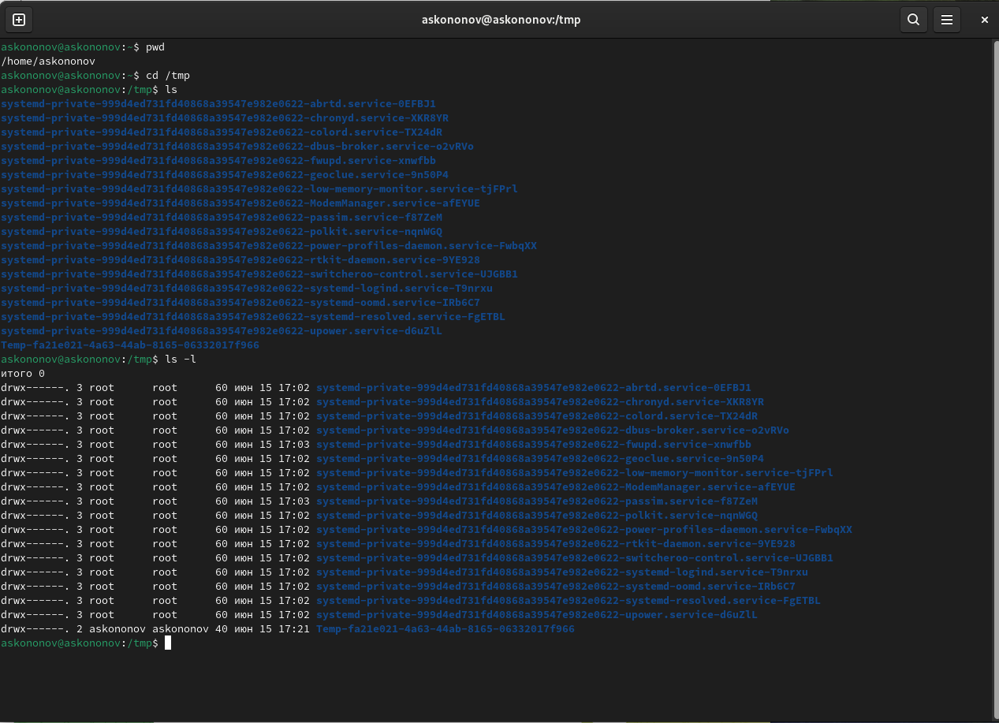{#fig:001 width=100%}

**ls -a** выводит список всех файлов, даже скрытых (имя которых начинается с точки) (рис. [-@fig:002]).
    
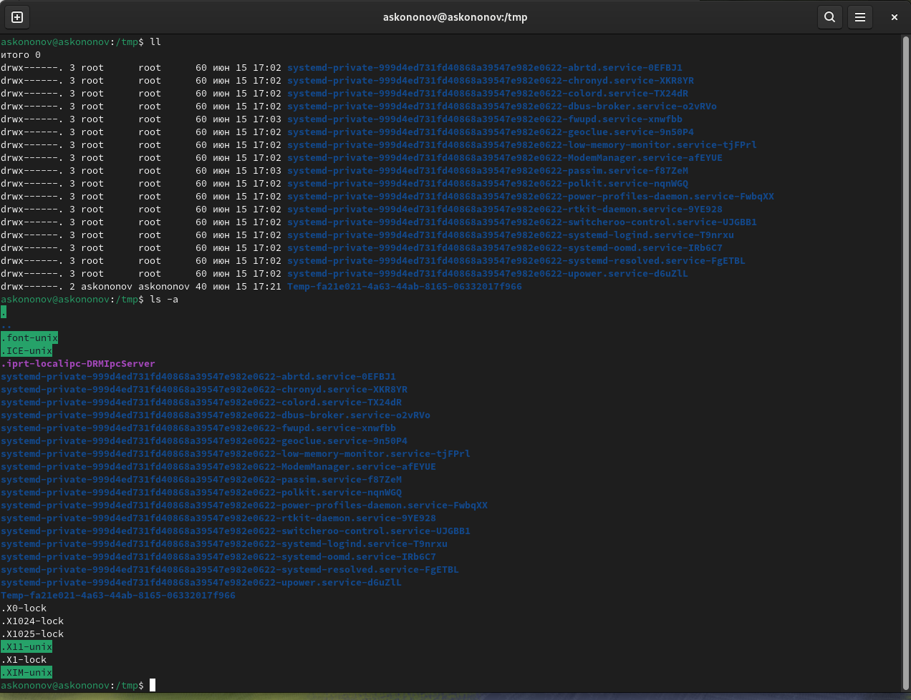{#fig:002 width=100%}

Комбинация **ls -alF** сортирует данные файлы по папкам и для наглядности ставит слэш (/) после каждой, при этом выводя подробную информацию о файлах и показывая скрытые файлы и папки.
А параметр **-F** выводит просто список всех файлов, сортируя их по папкам и ставя слэши для наглядности (рис. [-@fig:003]).
    
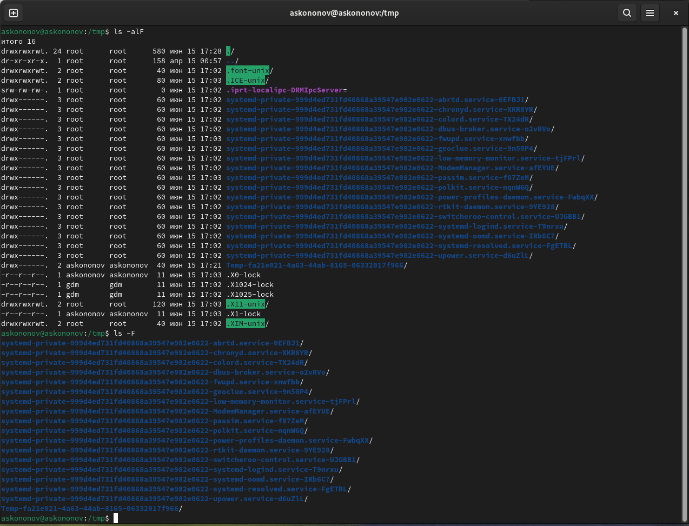{#fig:003 width=100%}

Теперь посмотрим, есть ли подкаталог с именем **cron**  в каталоге **/var/spool**. Для этого сначала перейдем в каталог командой **cd /var/spool**, а затем используем команду **ls**. И как видно, подкаталога **cron** там нет (рис. [-@fig:004]).

3. Чтобы вывести содрержимое домашнего каталога перейдем в него с помощью **cd** и используем команду **ls -l**, чтобы посмотреть, кто владелец. Владельцем всех файлов и каталогов являюсь я.

В домашнем каталоге создаю каталог с именем **newdir**, используя команду **mkdir**, и проверяю ее наличие с помощью **ls**.
Дальше создаю внутри него новый каталог с именем **morefun** .

Что бы создать или удалить сразу 3 новых директории используем **mkdir letters memos misk** и **rmdir letters memos misk** соответственно, и обязательно проверяем их наличие или отсутствие командой **ls**.

Попытка удалить **~/newdir** командой **rm** не сработает, так как это директория, а не файл.

Используем рекурсивное удаление каталога  (рис. [-@fig:004]).

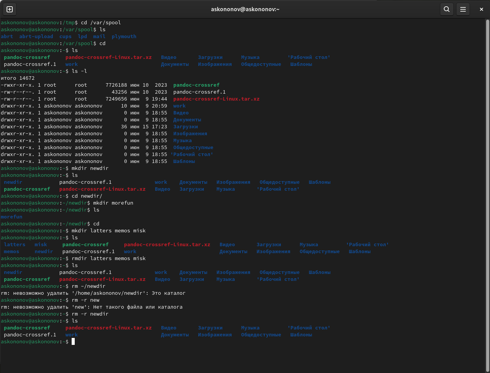{#fig:004 width=100%}

4. Необходимо узнать, какую опцию команды **ls** нужно использовать для просмотра содержимое не только указанного каталога, но и подкаталогов, входящих в него. Напишем команду **man ls** и видим, что для этого можно использовать опцию **-R** (рис. [-@fig:005]).

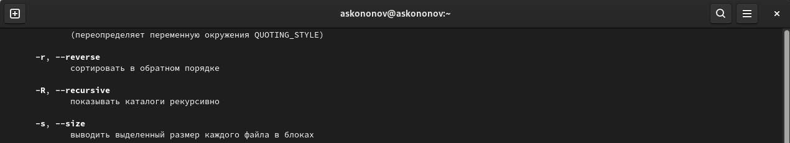{#fig:005 width=100%}

5. Узнаем набор опций команды **ls**, позволяющий отсортировать по времени последнего изменения выводимый список содержимого каталога с развёрнутым описанием файлов. В данном случаем подойдет опция **-c** (рис. [-@fig:006]).

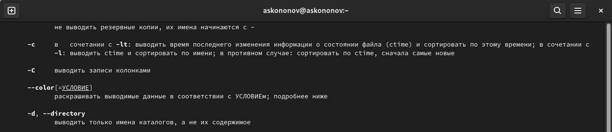{#fig:006 width=100%}

6. При помощи команды **man** узнаем опции следующих команд: 

- cd: Служит для перемещения по каталогам. Её аргумент - директория, в которую желает переместиться пользователь (рис. [-@fig:007]).

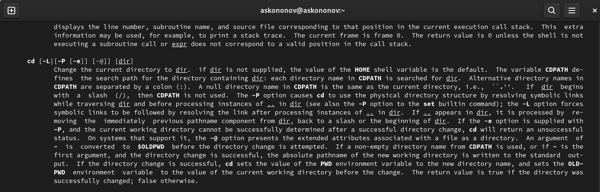{#fig:007 width=100%}

- pwd: Cлужит для вывода полного названия директории, в которой находится пользователь (рис. [-@fig:008]).

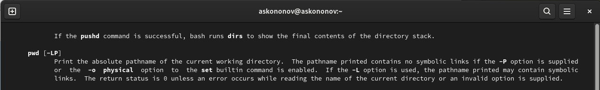{#fig:008 width=100%}

- mkdir: Служит для создания директорий (рис. [-@fig:009]).

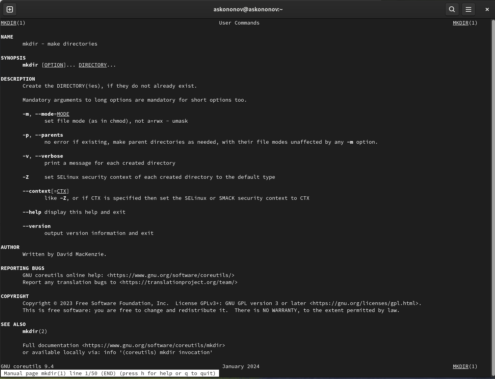{#fig:009 width=100%}

- rmdir: Удаляет пустые каталоги (рис. [-@fig:010]).

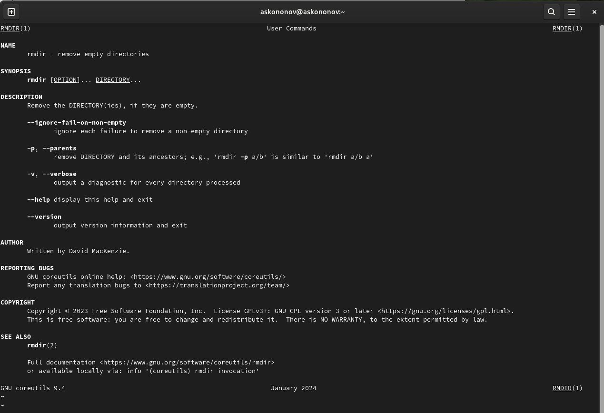{#fig:010 width=100%}

- rm: Удаляет файлы и каталоги (рис. [-@fig:011]).

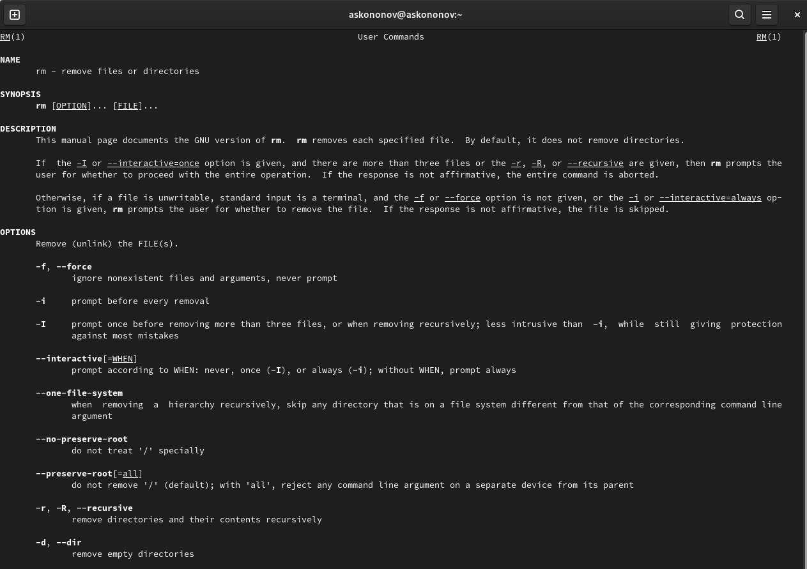{#fig:011 width=100%}

7. При помощи команды **history** выполним модификацию и исполнение некоторой команды из буфера команд (рис. [-@fig:012]).

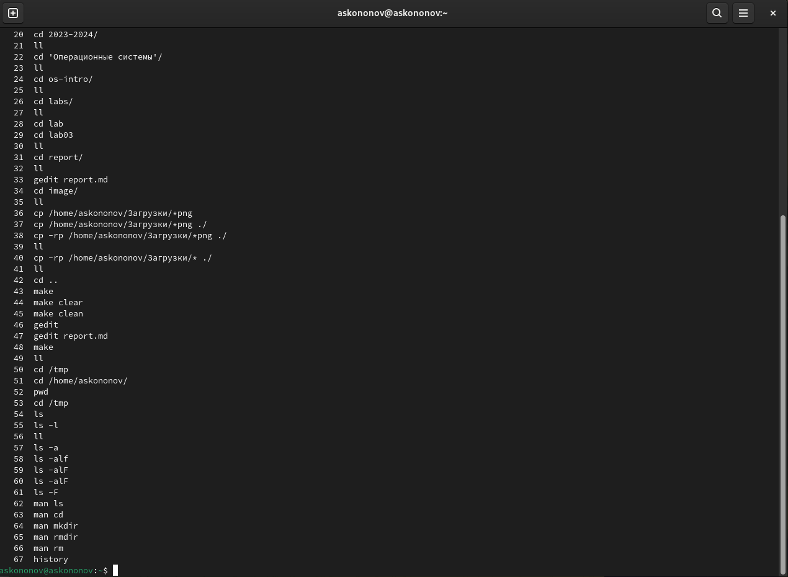{#fig:012 width=100%}

# Контрольные вопросы

1. **Что такое командная строка?**

Командная строка (или интерфейс командной строки) - это текстовый интерфейс, который позволяет пользователю взаимодействовать с операционной системой или приложением путем ввода текстовых команд. В операционных системах, таких как Windows, macOS и различных дистрибутивах Linux, командная строка предоставляет возможность запускать программы, управлять файлами, настраивать систему и выполнять другие задачи с помощью команд и параметров, вводимых с клавиатуры.

2. **При помощи какой команды можно определить абсолютный путь текущего каталога? Приведите пример.** 

Определить абсолютный путь текущего каталога можно с помощью команды pwd (PrintWorkingDirectory). Это вернет абсолютный путь текущего каталога, например: /home/user/documents.

3. **При помощи какой команды и каких опций можно определить только тип файлов и их имена в текущем каталоге? Приведите примеры.**

Для определения только типов файлов и их имен в текущем каталоге можно использовать команду "ls". Для получения более подробной информации о типах файлов имен можно использовать опцию "-F" для отображения в виде списка с дополнительными деталями. Например, использование команды ls -F в папке lab04/report даст нам следующее: bib/ image/ Makefile pandoc/ report.md. Мы видим. что bib/, image/, pandoc/ - это папки, а Makefile и report.md - файлы.

4. **Каким образом отобразить информацию о скрытых файлах?**

Для отображения информации о скрытых файлах можно использовать команду "ls" с опцией "-a". Опция "-a" позволяет отобразить все файлы, включая скрытые, которые обычно начинаются с точки.

5. **При помощи каких команд можно удалить файл и каталог? Можно ли это сделать одной и той же командой? Приведите примеры.**

Для удаления файлов в командной строке используется команда "rm" (remove), а для удаления каталогов используется команда "rmdir" или "rm" с опцией "-r" для рекурсивного удаления.

- Удаление файла: rm filename.txt

- Удаление каталога (если он пуст): rmdir directoryname

- Рекурсивное удаление каталога (включая все файлы и подкаталоги внутри): rm -r directoryname

6. **Каким образом можно вывести информацию о последних выполненных пользователем командах работы?**

Информацию о последних выполненных пользователем командах можно просмотреть с помощью команды "history". Эта команда выводит список последних выполненных команд в терминале, каждая сопровождается номером.

7. **Как воспользоваться историей команд для их модифицированного выполнения? Приведите примеры.**

Для выполнения модифицированных команд из истории можно воспользоваться символом "!" с номером строки истории, содержащей нужную команду. Также можно использовать различные опции для модификации и повторного выполнения предыдущих команд.

- Выполнение предыдущей команды: !!

Это выполнит немодифицированную версию последней команды.

- Выполнение команды по номеру в истории: !123

Это выполнит команду, которая была под номером 123 в истории.

- Выполнение команды с определенным текстом: !ls

Это выполнит последнюю команду, начинающуюся с "ls" из истории.

8. **Приведите примеры запуска нескольких команд в одной строке.**

Можно запускать несколько команд в одной строке, используя разделитель ";". Этот метод позволяет последовательно выполнять несколько команд.

- Выполнение нескольких команд последовательно: mkdir new_directory; cd new_directory; touch new_file.txt

В этом примере сначала создается новый каталог "new_directory", затем происходит переход в этот каталог, и наконец создается новый файл "new_file.txt".

- Комбинирование команд с условным выполнением: make build && make install

В этом примере команда "make install" будет выполнена только в случае успешного завершения команды "make build".

- Использование логического оператора "или": rm file1.txt || echo "File not found"

В этом примере, если файл "file1.txt" не найден, будет выведено сообщение "File not found".

9. **Дайте определение и приведите примера символов экранирования.**

Символ экранирования в программировании и командной строке используется для изменения значения другого символа. Обычно это достигается путем добавления обратной косой черты ("\") перед символом, который требуется экранировать.

Для использования апострофа внутри строки в командной строке, его можно экранировать с помощью обратной косой черты: echo "It"\"'s a beautiful day"

В командной строке, если требуется работать с файлом, имя которого содержит пробелы, необходимо экранировать пробелы в имени файла: cat my"\" file.txt

Например, в регулярных выражениях, для экранирования специальных символов, таких как точка (.), используется обратная косая черта: grep "end\." file.txt

Символ экранирования позволяет использовать специальные символы или управляющие последовательности в тексте без изменения их значения или поведения.

10. **Охарактеризуйте вывод информации на экран после выполнения команды ls с опцией l.**

Команда "ls" с опцией "-l" используется для вывода информации о файлах и каталогах в виде списка с дополнительными деталями. После выполнения этой команды, на экран будет выведена подробная информация о файлах и каталогах в текущем каталоге.

Обычно вывод содержит следующие столбцы:

- Тип файла и разрешения доступа.

- Количество ссылок на файл или каталог.

- Имя пользователя-владельца.

- Имя группы-владельца.

- Размер файла в байтах.

- Дата и время последней модификации.

- Имя файла или каталога.

11. **Что такое относительный путь к файлу? Приведите примеры использования относительного и абсолютного пути при выполнении какой-либо команды.**

Относительный путь к файлу - это путь, который указывает на местоположение файла относительно текущего рабочего каталога. Он не начинается с корневого каталога и используется для указания пути к файлу или каталогу относительно текущего местоположения.

Пример использования относительного пути:

Если текущий каталог находится по адресу "/home/user/", а нужный файл находится в подкаталоге "documents", то относительный путь к файлу "report.txt" будет выглядеть так: "documents/report.txt".

Абсолютный путь к файлу - это полный путь к файлу от корневого каталога файловой системы. Он всегда начинается с корневого каталога и указывает на точное местоположение файла в файловой системе.

Пример использования абсолютного пути:

Если файл "data.txt" находится в каталоге "/home/user/documents", то его абсолютный путь будет "/home/user/documents/data.txt".

12. **Как получить информацию об интересующей вас команде?**

Чтобы получить информацию о конкретной команде, можно воспользоваться несколькими способами:

- Команда man:

В большинстве случаев можно использовать команду "man" (от "manual") с названием интересующей команды, чтобы получить подробное описание и справку по этой команде. Например: man ls

Это отобразит руководство по команде "ls", включая ее опции и примеры использования.

- Команда --help:

Многие команды поддерживают опцию "--help", которая выводит краткую справку по команде и ее опциям. Например: ls --help

Это выведет краткую справку по команде "ls" и доступным опциям.

13. **Какая клавиша или комбинация клавиш служит для автоматического дополнения вводимых команд?**

Для автоматического дополнения вводимых команд используется клавиша "Tab". При вводе начала команды или пути к файлу можно нажать клавишу "Tab", и система автоматически дополнит набранное до уникально определяемой команды или пути.

# Выводы

В данной лабораторной работе мы приобрели практические навыки взаимодействия пользователя с системой посредством командной строки.

# Список литературы{.unnumbered}
::: {#refs}
:::

