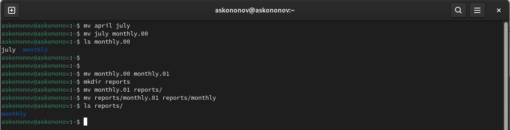

---
## Front matter
title: "Отчёта по лабораторной работе №5:"
subtitle: "Анализ файловой системы Linux. Команды для работы с файлами и каталогами"
author: "Кононов Алексей Сергеевич"

## Generic otions
lang: ru-RU
toc-title: "Содержание"

## Bibliography
bibliography: bib/cite.bib
csl: pandoc/csl/gost-r-7-0-5-2008-numeric.csl

## Pdf output format
toc: true # Table of contents
toc-depth: 2
lof: true # List of figures
fontsize: 12pt
linestretch: 1.5
papersize: a4
documentclass: scrreprt
## I18n polyglossia
polyglossia-lang:
  name: russian
  options:
	- spelling=modern
	- babelshorthands=true
polyglossia-otherlangs:
  name: english
## I18n babel
babel-lang: russian
babel-otherlangs: english
## Fonts
mainfont: PT Serif
romanfont: PT Serif
sansfont: PT Sans
monofont: PT Mono
mainfontoptions: Ligatures=TeX
romanfontoptions: Ligatures=TeX
sansfontoptions: Ligatures=TeX,Scale=MatchLowercase
monofontoptions: Scale=MatchLowercase,Scale=0.9
## Biblatex
biblatex: true
biblio-style: "gost-numeric"
biblatexoptions:
  - parentracker=true
  - backend=biber
  - hyperref=auto
  - language=auto
  - autolang=other*
  - citestyle=gost-numeric
## Pandoc-crossref LaTeX customization
figureTitle: "Рис."
tableTitle: "Таблица"
listingTitle: "Листинг"
lofTitle: "Список иллюстраций"
lolTitle: "Листинги"
## Misc options
indent: true
header-includes:
  - \usepackage{indentfirst}
  - \usepackage{float} # keep figures where there are in the text
  - \floatplacement{figure}{H} # keep figures where there are in the text
---

# Цель работы

Ознакомление с файловой системой Linux, её структурой, именами и содержанием каталогов. Приобретение практических навыков по применению команд для работы с файлами и каталогами, по управлению процессами (и работами), по проверке использования диска и обслуживанию файловой системы.

# Задание

1. Выполните все примеры, приведенные в первой части описания лабораторной работы.
2. Выполните следующие действия, зафиксировав в отчёте по лабораторной работе
используемые при этом команды и результаты их выполнения:
    1. Скопируйте файл `/usr/include/sys/io.h` в домашний каталог и назовите его
    equipment. Если файла `io.h` нет, то используйте любой другой файл в каталоге
    `/usr/include/sys/` вместо него.
    2. В домашнем каталоге создайте директорию `~/ski.places`.
    3. Переместите файл equipment в каталог `~/ski.places`.
    4. Переименуйте файл `~/ski.places/equipment` в `~/ski.places/equiplist`.
    5. Создайте в домашнем каталоге файл `abc1` и скопируйте его в каталог
    `~/ski.places`, назовите его `equiplist2`.
    6. Создайте каталог с именем `equipment` в каталоге `~/ski.places`.
    7. Переместите файлы `~/ski.places/equiplist` и `equiplist2` в каталог
    `~/ski.places/equipment`.
    8. Создайте и переместите каталог `~/newdir` в каталог `~/ski.places` и назовите
    его `plans`.
3. Определите опции команды chmod, необходимые для того, чтобы присвоить перечисленным 
ниже файлам выделенные права доступа, считая, что в начале таких прав нет:
    1. `drwxr--r-- ... australia`
    2. `drwx--x--x ... play`
    3. `-r-xr--r-- ... my_os`
    4. `-rw-rw-r-- ... feathers`
4. Проделайте приведённые ниже упражнения, записывая в отчёт по лабораторной
работе используемые при этом команды:
    1. Просмотрите содержимое файла `/etc/passwd`.
    2. Скопируйте файл ~/feathers в файл `~/file.old`.
    3. Переместите файл `~/file.old` в каталог `~/play`.
    4. Скопируйте каталог `~/play` в каталог `~/fun`.
    5. Переместите каталог `~/fun`в каталог `~/play` и назовите его `games`.
    6. Лишите владельца файла `~/feathers` права на чтение.
    7. Что произойдёт, если вы попытаетесь просмотреть файл 
    `~/feathers` командой cat?
    8. Что произойдёт, если вы попытаетесь скопировать файл `~/feathers`?
    9. Дайте владельцу файла `~/feathers` право на чтение.
    10. Лишите владельца каталога `~/play` права на выполнение.
    11. Перейдите в каталог `~/play`. Что произошло?
    12. Дайте владельцу каталога `~/play` право на выполнение.
5. Прочитайте man по командам `mount`, `fsck`, `mkfs`, `kill` и 
кратко их охарактеризуйте, приведя примеры.

# Теоретическое введение

Файловая структура - это организация данных на компьютере или в другой информационной системе,
которая определяет, как файлы и директории организованы и взаимодействуют друг с другом.

Для различных манипуляций с файловой структурой в Linux применяются специальные команды, которые будут
рассмотрены и использованы мной по ходу выполнения этой работы.

# Выполнение лабораторной работы

1. 
**Копирование файла в текущем каталоге** - скопировать файл ~/abc1 в файл april и в файл may.
**Копирование нескольких файлов в каталог** - скопировать файлы april и may в каталог monthly.
**Копирование файлов в произвольном каталоге** - скопировать файл monthly/may в файл с именем june.
**Копирование каталогов в текущем и произвольном каталогах** - скопировать каталог monthly в каталог monthly.00, скопировать каталог monthly.00 в каталог /tmp (рис. [-@fig:001]).
    
{#fig:001 width=100%}

**Переименование файлов в текущем каталоге** - изменить название файла april на july в домашнем каталоге. **Перемещение файлов в другой каталог** - переместить файл july в каталог monthly.00.
**Переименование каталогов в текущем каталоге** - переименовать каталог monthly.00 в monthly.01. **Перемещение каталога в другой каталог** - переместить каталог monthly.01 в каталог reports. **Переименование каталога, не являющегося текущим** - переименовать каталог reports/monthly.01 в reports/monthly (рис. [-@fig:002]).
    
{#fig:002 width=100%}

Создадим файл ~/may с правом выполнения для владельца, а затем лишим владельца прав на выполнение (рис. [-@fig:003]).
    
{#fig:003 width=100%}

2. Копируем файл /usr/include/sys/io.h в домашний каталог и назовем его equipment. В домашнем каталоге создадим директорию ~/ski.plases и переместим файл equipment в новый каталог. Поменяем название на equiplist. Создадим в домашнем каталоге файл abc1 и скопируем его в каталог ~/ski.plases и назовем его equiplist2.
Создадим каталог с именем equipment в каталоге ~/ski.plases. Затем переместим файлы ~/ski.plases/equiplist и equiplist2 в каталог ~/ski.plases/equipment.
Создадим и переместим каталог ~/newdir в каталог ~/ski.plases и назовем его plans. (рис. [-@fig:004]).
    
{#fig:004 width=100%}

3. - **drwxr--r-- ... australia**: создаем australia, проверяем права, используем `chmod g-x,o-x australia`, чтобы изменить на нужные права (рис. [-@fig:005]).

{#fig:005 width=100%}

- **drwx--x--x ... play**: делаем то же самое, используем `chmod g-r,o-r play` (рис. [-@fig:006]).

{#fig:006 width=100%}

- **-r-xr--r-- ... my_os**: создаем файл my_os, используем `chmod u-w,u+x my-os`.

- **-rw-rw-r-- ... feathers**: используем `chmod g+w feathers` (рис. [-@fig:007]).

{#fig:007 width=100%}

4. Посмотрим файл /etc/passwd с помощью **cat** (рис. [-@fig:008]).

{#fig:008 width=100%}

Копируем ~/feathers в ~/file.old, переместим ~/file.old в каталог ~/play.
Копируем каталог ~/play в каталог ~/fun, а ~/fun в каталог ~/play и переименовываем в games(рис. [-@fig:009]).

{#fig:009 width=100%}

Лишим владельца файла ~/feathers права на чтение, используя команду `chmod u-r feathers`. Если мы попробуем просмотреть файл ~/feathers командой cat, то нам будет отказано в доступе, то же самое произойдет, если захотим скопировать данный файл. После вернем все обратно командой `chmod u+r feathers`.
Лишим теперь владельца каталога ~/play права на выполнение, командой `chmod u-x play`. Попробуем перейти в каталог ~/play, то нам будет отказано в доступе. Вернем владельцу каталога ~/play право на выполнение, командой `chmod u+x play` (рис. [-@fig:010]).

{#fig:010 width=100%}

Прочитаем man по командам mount, fsck, mkfs, kill:

- **mount**: команда mount используется для подключения файловых систем к каталогу в иерархии файловой системы (рис. [-@fig:011]).

{#fig:011 width=100%}

- **fsck**: команда fsck (file system check) предназначена для проверки и исправления целостности файловых систем (рис. [-@fig:012]).

{#fig:012 width=100%}

- **mkfs**: команда mkfs (make file system) используется для создания новой файловой системы на указанном устройстве (рис. [-@fig:013]).

{#fig:013 width=100%}

- **kill**: команда kill используется для отправки сигнала процессу или группе процессов, что может привести к их завершению (рис. [-@fig:014]).

{#fig:014 width=100%}

# Контрольные вопросы

1. **Приведите общую структуру файловой системы и дайте характеристику каждой директории первого уровня этой структуры.**

Общая структура файловой системы в большинстве операционных систем может быть представлена следующим образом:

**/** - корневая директория

**/bin** - содержит основные исполняемые файлы, необходимые для загрузки и базовых операций в системе.

**/boot** - содержит файлы, необходимые для загрузки операционной системы.

**/dev** - содержит файлы, представляющие устройства в системе.

**/etc** - содержит конфигурационные файлы для системы и установленных программ.

**/home** - директории пользователей.

**/lib** - содержит библиотеки, необходимые для запуска исполняемых файлов в /bin и /sbin.

**/media** - место для монтирования временных носителей, таких как USB-накопители.

**/mnt** - место для временного монтирования файловых систем.

**/opt** - используется для установки "дополнительных" программ.

**/proc** - виртуальная файловая система, предоставляющая информацию о процессах в системе.

**/root** - домашняя директория суперпользователя (root).

**/run** - временная файловая система, хранящая данные, специфичные для текущего запуска системы.

**/sbin** - содержит основные системные исполняемые файлы.

**/srv** - содержит данные, используемые локальными сервисами.

**/sys** - виртуальная файловая система, предоставляющая информацию о ядре Linux.

**/tmp** - временная директория, доступная всем пользователям для временных файлов.

**/usr** - вторичная иерархия, содержащая все несистемные программы и данные.

**/var** - содержит изменяемые файлы, такие как журналы, временные файлы и кэши.

2. **Какая операция должна быть выполнена, чтобы содержимое некоторой файловой системы было доступно операционной системе?**

Какая операция должна быть выполнена, чтобы содержимое некоторой файловой системы было доступно операционной системе? Для того чтобы содержимое файловой системы было доступно операционной системе Linux, необходимо выполнить `mount` данной файловой системы. 

3. **Назовите основные причины нарушения целостности файловой системы. Как устранить повреждения файловой системы?**

Основные причины нарушения целостности файловой системы включают:

- **Сбои в питании**: Внезапное отключение питания может привести к повреждению файлов, так как операции записи могут быть прерваны, что приводит к неправильному состоянию файловой системы.

- **Сбои в работе жёсткого диска или других устройств хранения данных**: Неисправности жестких дисков или других устройств хранения данных могут вызвать повреждение файлов и структуры файловой системы.

- **Вирусы и вредоносное ПО**: Атаки вирусов и вредоносного программного обеспечения могут изменять или удалять файлы, что приводит к нарушению целостности файловой системы.

- **Неправильное завершение работы программ или операционной системы**: Если программа или операционная система завершается некорректно, это может привести к повреждению файлов и структуры файловой системы.

- **Физические повреждения устройств хранения данных**: Механические повреждения жестких дисков или других устройств хранения данных могут привести к потере данных и повреждению файловой системы.

Для устранения повреждений файловой системы можно предпринять следующие шаги:

- **Проверка и восстановление файловой системы**: Использование специальных инструментов, таких как fsck в Linux, для проверки и восстановления целостности файловой системы.

- **Использование резервных копий**: Восстановление поврежденных файлов из резервных копий, если они доступны.

- **Использование специализированных программ**: Использование специализированных программ для восстановления данных с поврежденных устройств хранения.

- **Замена неисправных устройств хранения данных**: В случае физических повреждений устройств хранения данных требуется их замена и восстановление данных из резервных копий, если таковые имеются.

- **Установка антивирусного ПО и обновление системы**: Защита от вирусов и вредоносного ПО путем установки антивирусного программного обеспечения и регулярное обновление операционной системы для устранения уязвимостей.

Кроме того, важно регулярно создавать резервные копии данных, чтобы в случае повреждения файловой системы можно было восстановить данные из последней рабочей копии.

4. **Как создаётся файловая система?**

Файловая система в ОС Linux создается командой `mkfs`. Пример: `sudo mkfs -t ext4 /dev/sdb`

5. **Дайте характеристику командам для просмотра текстовых файлов.**

Команды для просмотра текстовых файлов предоставляют пользователю возможность просматривать содержимое текстовых файлов непосредственно в терминале или командной строке. Вот несколько основных команд для просмотра текстовых файлов:

- **cat**: Команда `cat` (concatenate) используется для отображения содержимого одного или нескольких файлов в терминале. Она также может использоваться для объединения нескольких файлов и вывода содержимого на экран.

- **less**: Команда `less` позволяет просматривать содержимое файла постранично. Это удобно для просмотра больших файлов, так как позволяет легко прокручивать вперед и назад, а также искать в тексте.

- **more**: Подобно команде `less`, команда `more` также используется для просмотра содержимого файла постранично. Однако `more` менее гибкая по сравнению с `less`.

- **head**: Команда `head` выводит начальные строки текстового файла. По умолчанию выводится 10 первых строк файла, но это количество можно изменить с помощью параметра.

- **tail**: Команда `tail` выводит конечные строки текстового файла. По умолчанию выводится 10 последних строк файла, но это количество также можно изменить с помощью параметра.

6. **Приведите основные возможности команды cp в Linux.**

Команда `cp`{.bash} используется для копирования файлов и каталогов. 
Например: `cp file1 file2 file3 ~/mydir`.

7. **Приведите основные возможности команды mv в Linux.**

Команды `mv`{.bash} предназначены для перемещения и переименования файлов
и каталогов. Переименование файла: `mv old_name new_name`.

8. **Что такое права доступа? Как они могут быть изменены?**

Права доступа определяют, какие действия могут выполнять пользователи и программы в отношении файлов и каталогов. В системах Unix-подобных операционных системах (таких как Linux), каждый файл и каталог имеет набор прав доступа, который определяет, кто может читать, записывать или выполнять файл, а также кто может изменять его.

Вот основные типы прав доступа:

- **Чтение (Read)**: Пользователь или программа может просматривать содержимое файла или каталога.

- **Запись (Write)**: Пользователь или программа может изменять файл или каталог, добавлять или удалять содержимое.

- **Выполнение (Execute)**: Для каталогов это позволяет входить в каталог и выполнять команды внутри него. Для файлов это позволяет запускать исполняемые файлы.

Права доступа могут быть изменены с помощью команды `chmod` в терминале Linux. Вот основные способы изменения прав доступа:

- **Использование символьной нотации**: Например, `chmod u+r file.txt` добавляет право чтения для владельца файла.

- **Использование числовой нотации**: Назначение прав осуществляется через числовые значения, такие как 755, где каждая цифра представляет набор прав для владельца, группы и других пользователей соответственно.

- **Изменение прав доступа по битам**: Используя флаги `u`, `g`, `o` и комбинации `+` и `-` можно добавлять или удалять права доступа.

# Выводы

В этой работе мы познакомились с устройством файловой системы ОС Linux и командами для взаимодействия с ней. Научились копировать и перемещать файлы, а также задавать им права доступа.

# Список литературы{.unnumbered}

1. Руководство к лабораторной работе №4.

::: {#refs}
:::

