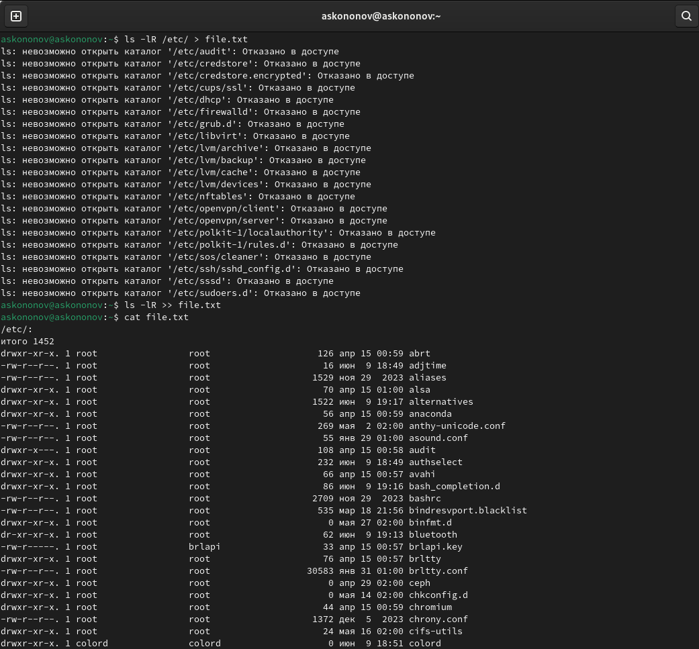
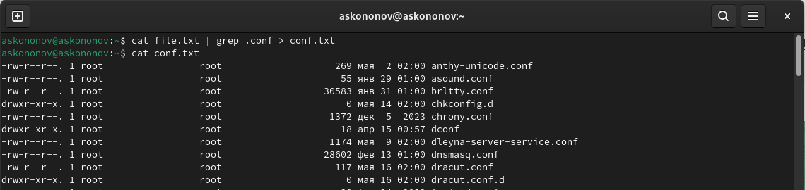
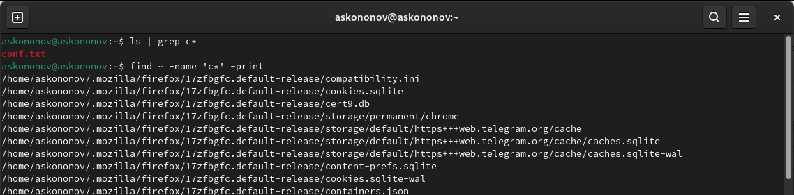
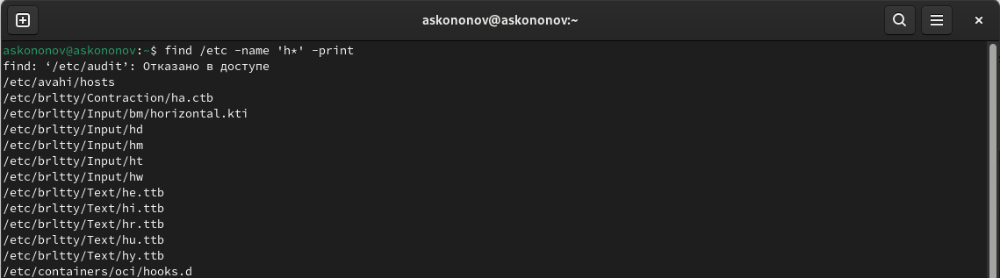
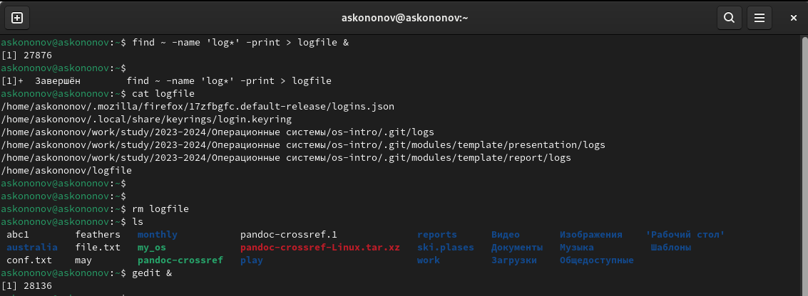
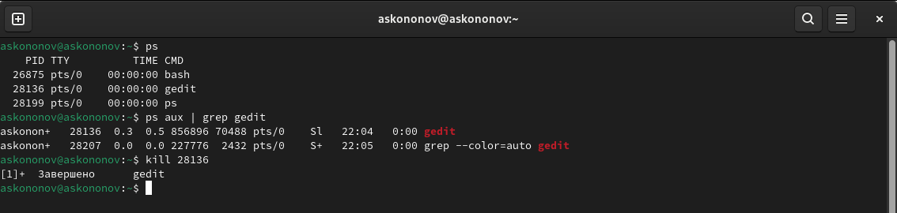
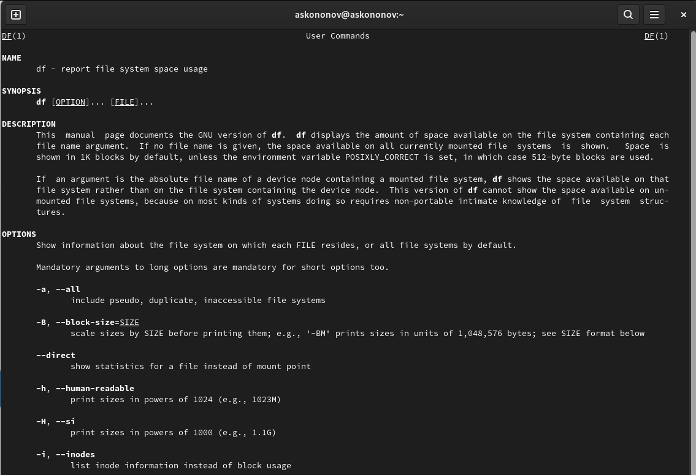
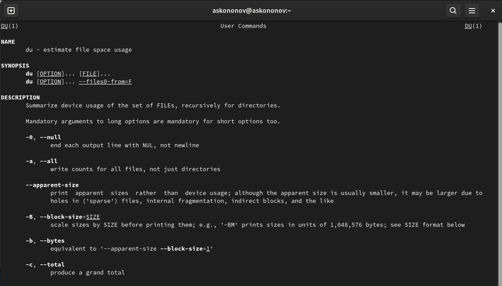
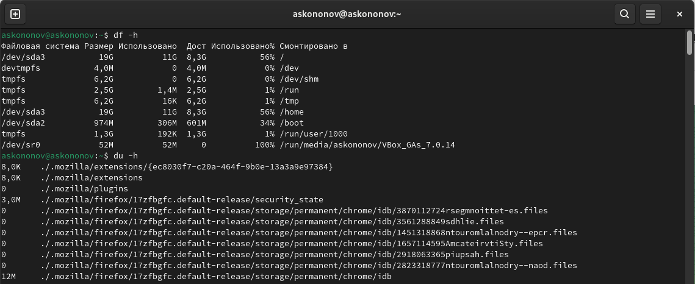
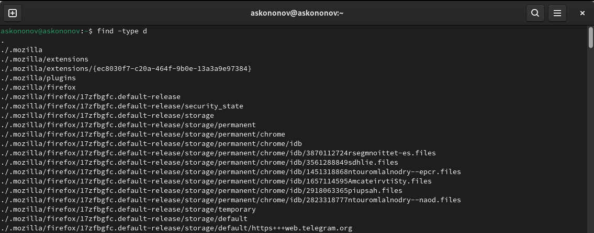

---
## Front matter
title: "Отчёта по лабораторной работе №6:"
subtitle: "Поиск файлов. Перенаправление ввода-вывода. Просмотр запущенных процессов"
author: "Кононов Алексей Сергеевич"

## Generic otions
lang: ru-RU
toc-title: "Содержание"

## Bibliography
bibliography: bib/cite.bib
csl: pandoc/csl/gost-r-7-0-5-2008-numeric.csl

## Pdf output format
toc: true # Table of contents
toc-depth: 2
lof: true # List of figures
fontsize: 12pt
linestretch: 1.5
papersize: a4
documentclass: scrreprt
## I18n polyglossia
polyglossia-lang:
  name: russian
  options:
	- spelling=modern
	- babelshorthands=true
polyglossia-otherlangs:
  name: english
## I18n babel
babel-lang: russian
babel-otherlangs: english
## Fonts
mainfont: PT Serif
romanfont: PT Serif
sansfont: PT Sans
monofont: PT Mono
mainfontoptions: Ligatures=TeX
romanfontoptions: Ligatures=TeX
sansfontoptions: Ligatures=TeX,Scale=MatchLowercase
monofontoptions: Scale=MatchLowercase,Scale=0.9
## Biblatex
biblatex: true
biblio-style: "gost-numeric"
biblatexoptions:
  - parentracker=true
  - backend=biber
  - hyperref=auto
  - language=auto
  - autolang=other*
  - citestyle=gost-numeric
## Pandoc-crossref LaTeX customization
figureTitle: "Рис."
tableTitle: "Таблица"
listingTitle: "Листинг"
lofTitle: "Список иллюстраций"
lolTitle: "Листинги"
## Misc options
indent: true
header-includes:
  - \usepackage{indentfirst}
  - \usepackage{float} # keep figures where there are in the text
  - \floatplacement{figure}{H} # keep figures where there are in the text
---

# Цель работы

Ознакомление с инструментами поиска файлов и фильтрации текстовых данных. Приобретение практических навыков: по управлению процессами (и заданиями), по проверке использования диска и обслуживанию файловых систем.

# Задание

1. Осуществите вход в систему, используя соответствующее имя пользователя.
2. Запишите в файл `file.txt` названия файлов, содержащихся в каталоге `/etc`. 
Допишите в этот же файл названия файлов, содержащихся в вашем домашнем каталоге.
3. Выведите имена всех файлов из `file.txt`, имеющих расширение `.conf`, после чего
запишите их в новый текстовой файл `conf.txt`.
4. Определите, какие файлы в вашем домашнем каталоге имеют имена, начинавшиеся
с символа `c`? Предложите несколько вариантов, как это сделать.
5. Выведите на экран (по странично) имена файлов из каталога `/etc`, начинающиеся
с символа `h`.
6. Запустите в *фоновом режиме* процесс, который будет записывать в файл `~/logfile`
файлы, имена которых начинаются с `log`.
7. Удалите файл `~/logfile`.
8. Запустите из консоли в *фоновом режиме* редактор `gedit`.
9. Определите идентификатор процесса `gedit`, используя команду `ps`, конвейер и фильтр
`grep`. Как ещё можно определить идентификатор процесса?
10. Прочтите справку `man` команды `kill`, после чего используйте её для завершения
процесса `gedit`.
11. Выполните команды `df` и `du`, предварительно получив более подробную информацию
об этих командах, с помощью команды `man`.
12. Воспользовавшись справкой команды `find`, выведите имена всех директорий, 
имеющихся в вашем домашнем каталоге.

# Теоретическое введение

В процессе работы с файловой системой Linux часто возникает необходимость 
в поиске определенных файлов по различным критериям, таким как имя файла, 
размер, тип и т.д. Мы рассмотрим различные инструменты командной строки, такие 
как `find` и `grep`, которые позволяют эффективно выполнять поиск файлов.

Перенаправление ввода-вывода --- еще один мощный механизм командной строки, 
который позволяет изменять потоки данных между программами и файлами.
Мы изучим основные способы перенаправления ввода-вывода, такие как 
использование символов перенаправления `>` `>>`, `<<` `<` и `|`, а также их 
применение в различных сценариях.

Для эффективного управления системой важно иметь возможность просматривать 
информацию о текущих процессах, запущенных на компьютере. Мы ознакомимся с 
командами `ps`, `top` и `htop`, которые предоставляют 
информацию о процессах и ресурсах системы в реальном времени.

# Выполнение лабораторной работы

Используя `ls -lR /etc > file.txt` запишем в файл file.txt названия файлов, содержащихся в каталоге /etc. Допишем в файл названия файлов, содержащихся в вашем домашнем каталоге `ls -lR >> file.txt`. Проверим  с помощью `cat file.txt` содержимое (рис. [-@fig:001]).

{#fig:001 width=100%}

Возьмем имена всех файлов из file.txt, имеющих расширение .conf, после чего запишите их в новый текстовой файл conf.txt `cat file.txt | grep .conf > conf.txt`(рис. [-@fig:002]).

{#fig:002 width=100%}

Определим, какие файлы в домашнем каталоге имеют имена, начинавшиеся с символа `ls | grep c*`, или `find ~ -name 'c*' -print` (рис. [-@fig:003]).
    
{#fig:003 width=100%}

Командой `find /etc -name 'h*' -print`выведем на экран имена файлов из каталога /etc, начинающиеся с символа "h" (рис. [-@fig:004]).

{#fig:004 width=100%}

Запустим в фоновом режиме процесс, который будет записывать в файл ~/logfile файлы, имена которых начинаются с "log" `find ~ -name "log*" -print > logfile &` полсе чего прервем. Посмотрим, что записалось и удалим ~/logfile, используя `rm logfile`.
Запустим из консоли в фоновом режиме редактор gedit с помощью команды `gedit &` (рис. [-@fig:005]).
    
{#fig:005 width=100%}

Используем `ps`, чтобы вывести все процессы, а для поиска gedit вводим `ps aux | grep gedit`.
Исользуем kill для завершения процесса gedit (рис. [-@fig:006]).
    
{#fig:006 width=100%}

C помощью `man` узнаем как работают df и du (рис. [-@fig:007]) (рис. [-@fig:008]).

{#fig:007 width=100%}
    
{#fig:008 width=100%}

Команда **df** используется для отображения информации о дисковом пространстве на файловых системах, включая общий объем, использованный объем, доступное пространство и место, занятое системными файлами.
Команда **du** используется для оценки использования дискового пространства файлами и каталогами в Linux. По умолчанию du показывает использование дискового пространства для текущего каталога (рис. [-@fig:009]).

{#fig:009 width=100%}

Выведем имена всех директорий, имеющихся в вашем домашнем каталоге, использовав команду `find -type d` (рис. [-@fig:010]).

{#fig:010 width=100%}

# Контрольные вопросы

1. **Какие потоки ввода вывода вы знаете?**

`stdin` - Стандартный поток ввода (по умолчанию: клавиатура), файловый дескриптор `0`.
`stdout` - Стандартный поток вывода (по умолчанию: консоль), файловый дескриптор `1`.
`stderr` -  Стандартный поток вывод сообщений об ошибках (по умолчанию: консоль), файловый дескриптор `2`.

2. **Объясните разницу между операцией > и >>.**

Операция `>` используется для перенаправления вывода команды в файл, при этом файл будет перезаписан, если уже существует. Операция `>>` также перенаправляет вывод команды в файл, но добавляет вывод в конец файла, не перезаписывая его.

3. **Что такое конвейер?**

Конвейер (pipeline) - это механизм в UNIX, позволяющий объединить вывод одной команды с вводом другой команды без использования промежуточных файлов. Это позволяет создавать цепочки команд для выполнения сложных задач

4. **Что такое процесс? Чем это понятие отличается от программы?**

Процесс - это экземпляр программы, который выполняется на компьютере в определенный 
момент времени. Программа, с другой стороны, представляет собой статический набор 
инструкций и данных, который сохранен на диске и ожидает выполнения.

5. **Что такое PID и GID?**

`PID`- Это уникальный числовой идентификатор, присваиваемый операционной системой каждому процессу при его создании. `PID` используется для идентификации и управления процессами в системе. Когда вы запускаете программу или команду в терминале, операционная система назначает ей уникальный `PID`, который может быть использован для мониторинга, завершения или взаимодействия с процессом.
`GID` - Это числовой идентификатор, связанный с определенной группой пользователей на операционной системе. Каждый пользователь может принадлежать одной или нескольким группам, и `GID` используется для определения принадлежности пользователей к этим группам. `GID` может использоваться для управления правами доступа к файлам и ресурсам, которые принадлежат определенной группе пользователей.

6. **Что такое задачи и какая команда позволяет ими управлять?**

Задачи (jobs) - это процессы, запущенные в фоновом режиме в командной оболочке. Команда `jobs` используется для просмотра списка задач и управления ими.

7. **Найдите информацию об утилитах top и htop. Каковы их функции?**

Утилиты `top` и `htop` предоставляют информацию о процессах, выполняемых в системе, и ресурсах, которые они используют. `top` - это стандартная утилита, а `htop` представляет более удобный интерфейс для мониторинга процессов.

8. **Назовите и дайте характеристику команде поиска файлов. Приведите примеры использования этой команды.**

Команда поиска файлов в UNIX-подобных системах - `find`. Она используется для поиска файлов и каталогов в указанном месте с заданными критериями. Пример использования: `find /path/to/directory -name "*.txt"`.

9. **Можно ли по контексту (содержанию) найти файл? Если да, то как?**

Да, можно найти файл по его содержанию с помощью команды `grep`. Пример: `grep "search_term" file.txt`.

10. **Как определить объем свободной памяти на жёстком диске?**

Чтобы определить объем свободной памяти на жестком диске, можно использовать команду `df -h`.

11. **Как определить объем вашего домашнего каталога?**

Чтобы определить объем вашего домашнего каталога, можно воспользоваться командой `du -sh ~`.

12. **Как удалить зависший процесс?**

Чтобы удалить зависший процесс, можно воспользоваться командой `kill -9 PID`, где PID - идентификатор процесса, который нужно завершить.

# Выводы

В данной лабораторной работе мы ознакомились с инструментами поиска файлов и фильтрации текстовых данных. Приобретение практических навыков: по управлению процессами (и заданиями), по проверке использования диска и обслуживанию файловых систем.

# Список литературы{.unnumbered}

::: {#refs}
:::

