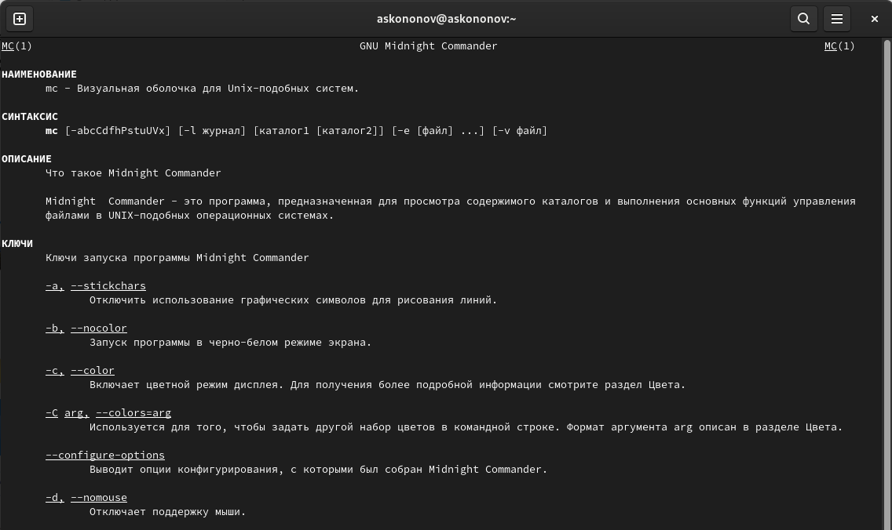
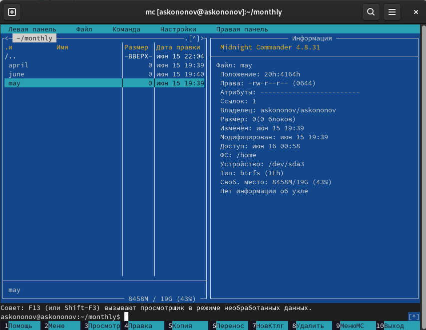

---
## Front matter
title: "Отчёта по лабораторной работе №7:"
subtitle: " Командная оболочка Midnight Commander"
author: "Кононов Алексей Сергеевич"

## Generic otions
lang: ru-RU
toc-title: "Содержание"

## Bibliography
bibliography: bib/cite.bib
csl: pandoc/csl/gost-r-7-0-5-2008-numeric.csl

## Pdf output format
toc: true # Table of contents
toc-depth: 2
lof: true # List of figures
fontsize: 12pt
linestretch: 1.5
papersize: a4
documentclass: scrreprt
## I18n polyglossia
polyglossia-lang:
  name: russian
  options:
	- spelling=modern
	- babelshorthands=true
polyglossia-otherlangs:
  name: english
## I18n babel
babel-lang: russian
babel-otherlangs: english
## Fonts
mainfont: PT Serif
romanfont: PT Serif
sansfont: PT Sans
monofont: PT Mono
mainfontoptions: Ligatures=TeX
romanfontoptions: Ligatures=TeX
sansfontoptions: Ligatures=TeX,Scale=MatchLowercase
monofontoptions: Scale=MatchLowercase,Scale=0.9
## Biblatex
biblatex: true
biblio-style: "gost-numeric"
biblatexoptions:
  - parentracker=true
  - backend=biber
  - hyperref=auto
  - language=auto
  - autolang=other*
  - citestyle=gost-numeric
## Pandoc-crossref LaTeX customization
figureTitle: "Рис."
tableTitle: "Таблица"
listingTitle: "Листинг"
lofTitle: "Список иллюстраций"
lolTitle: "Листинги"
## Misc options
indent: true
header-includes:
  - \usepackage{indentfirst}
  - \usepackage{float} # keep figures where there are in the text
  - \floatplacement{figure}{H} # keep figures where there are in the text
---

# Цель работы

Освоение основных возможностей командной оболочки Midnight Commander. Приобретение навыков практической работы по просмотру каталогов и файлов; манипуляций с ними.

# Задание

**Задание по mc**

1. Изучите информацию о `mc`, вызвав в командной строке man `mc`.
2. Запустите из командной строки `mc`, изучите его структуру и меню.
3. Выполните несколько операций в mc, используя управляющие клавиши (операции с панелями; выделение/отмена выделения файлов, копирование/перемещение файлов, получение информации о размере и правах доступа на файлы и/или каталоги и т.п.).
4. Выполните основные команды меню левой (или правой) панели. Оцените степень подробности вывода информации о файлах.
5. Используя возможности подменю Файл, выполните:
    - просмотр содержимого текстового файла;
    - редактирование содержимого текстового файла (без сохранения результатов редактирования);
    - создание каталога;
    - копирование в файлов в созданный каталог.
6. С помощью соответствующих средств подменю Команда осуществите:
    - поиск в файловой системе файла с заданными условиями (например, файла с расширением `.c` или `.cpp`, содержащего строку `main`);
    - выбор и повторение одной из предыдущих команд;
    - переход в домашний каталог;
    - анализ файла меню и файла расширений.
7. Вызовите подменю Настройки. Освойте операции, определяющие структуру экрана `mc` (Full screen, Double Width, Show Hidden Files и т.д.)

## Задание по встроенному редактору mc

1. Создайте текстовой файл text.txt.
2. Откройте этот файл с помощью встроенного в mc редактора.
3. Вставьте в открытый файл небольшой фрагмент текста, скопированный из любого другого файла или Интернета.
4. Проделайте с текстом следующие манипуляции, используя горячие клавиши:
- Удалите строку текста.
- Выделите фрагмент текста и скопируйте его на новую строку.
- Выделите фрагмент текста и перенесите его на новую строку.
- Сохраните файл.
- Отмените последнее действие.
- Перейдите в конец файла (нажав комбинацию клавиш) и напишите некоторый текст.
- Перейдите в начало файла (нажав комбинацию клавиш) и напишите некоторый текст.
- Сохраните и закройте файл.

# Теоретическое введение

*Командная оболочка* — интерфейс взаимодействия пользователя с операционной системой и программным обеспечением посредством команд.

*Midnight Commander* — псевдографическая командная оболочка для UNIX/Linux систем. Для запуска mc необходимо в командной строке набрать mc и нажать Enter.

# Выполнение лабораторной работы

1. Информацию о **mc** поолучаем `man mc` (рис. [-@fig:001]).

{#fig:001 width=100%}

2. Запустим mc с помощью `mc` (рис. [-@fig:002]).

{#fig:002 width=100%}

3. Выполним несколько операций в mc, используя управляющие клавиши.

Переключиться на верхнюю панель меню - F9, переключаться между вкладками - стрелочки, а если необходимо что-то выбрать - Enter (рис. [-@fig:003]).
    
{#fig:003 width=100%}

Ctrl-x + c позволяет просмотреть права доступа к файлу (рис. [-@fig:004]).
    
{#fig:004 width=100%}

Копирование - F5, если необходимо перенести - F6 (рис. [-@fig:005]).

{#fig:005 width=100%}

4. 'Правая панель' затем 'Информация' поокажет справа информацию о каталоге или файле (рис. [-@fig:006]).
    
{#fig:006 width=100%}

5. 'Файл'. Для просмотра файла используем F3, а для выхода - F10 (рис. [-@fig:007]).
    
{#fig:007 width=100%}

Для редактирования используется F4. (рис. [-@fig:008]).
    
{#fig:008 width=100%}

Переходим в директорию, где хотим создать каталог, нажимаем F7 (рис. [-@fig:009]).
    
{#fig:009 width=100%}

Скопируем текстовый файл в только что созданный каталог с помощью клавиши F5 (рис. [-@fig:010]).
    
{#fig:010 width=100%}

6. С помощью соответствующих средств подменю "Команда" осуществим: 

Найдем файл с расширением .cpp, содержащего строку main. Для этого переходим в подменю "Команда" -> "Поиск файлов", вводим необходимые данные и смотрим. В моем случае таких файлов нет (рис. [-@fig:011]).

{#fig:011 width=100%}

С помощью "Дерево каталога" перейдем в домашний каталог (рис. [-@fig:012]).

{#fig:012 width=100%}

Поосмотрим файл меню (рис. [-@fig:013]).

{#fig:013 width=100%}

Файл расширений (рис. [-@fig:014]).

{#fig:014 width=100%}

7. Вызовем подменю "Настройки" и освоим операции, определяющие структуру экрана mc.

Рассмотрим настройки и конфигурацию (рис. [-@fig:015]), (рис. [-@fig:016]), (рис. [-@fig:017]).

{#fig:015 width=100%}

{#fig:016 width=100%}

{#fig:017 width=100%}

**Выполним задания по встроенному редактору mc**

1. Создадаем файл text.txt в ранее созданном каталоге. Используем команду `touch text.txt` (рис. [-@fig:018]).

{#fig:018 width=100%}

2. Откроем этот файл с помощью F4.
3. Вставим текст Ctrl + Shift + V (рис. [-@fig:019]).

{#fig:019 width=100%}

4. Используем для работы с текстом горячие клавиши.

- Удаление строки текста - выделяем строку и F8
- Выделим фрагмент текста и скопируем его на новую строку - выделяем, выбираем место курсором и используем F5 (рис. [-@fig:020]).

{#fig:020 width=100%}

- Выделим фрагмент текста и перенесем его на новую строку - то же самое, но F6 (рис. [-@fig:021]).

{#fig:021 width=100%}

- Сохранение - F2.
- Отмена пооследнего действия - Ctrl + U.
- Перейдем в конец файла - Ctrl + End, и напишем некоторый текст. Перейдем в начало файла - Ctrl + Home и добавим еще текст (рис. [-@fig:022])

{#fig:022 width=100%}

- Закрытие с сохранением или без - F10 (рис. [-@fig:023]).

{#fig:023 width=100%}

# Контрольные вопросы

1. **Какие режимы работы есть в mc. Охарактеризуйте их.**

В `Midnight Commander` существуют следующие режимы работы:
	1. **Панельный режим** (Panel mode): Этот режим является основным для `Midnight Commander`. Он представляет собой интерфейс, разделенный на две панели, каждая из которых отображает содержимое различных директорий. Пользователь может перемещаться между файлами и директориями, копировать, перемещать, удалять и редактировать файлы, используя соответствующие команды и клавиши быстрого доступа.
	2. **Командный режим** (Command mode): В этом режиме пользователь может вводить команды непосредственно в командную строку `Midnight` Commander, аналогично обычной командной строке `Unix`. Этот режим предоставляет доступ к широкому спектру команд и опций `Midnight Commander`, таких как поиск файлов, изменение прав доступа, архивация и многое другое. Командный режим удобен для выполнения специализированных операций, которые могут быть неудобны или невозможны в панельном режиме.
	3. **Режим просмотра файла** (Viewer mode): Этот режим предназначен для просмотра содержимого файлов непосредственно внутри Midnight Commander, без необходимости открывать их во внешних приложениях. Пользователь может использовать клавиши быстрого доступа для навигации по файлу, поиска определенных строк и выполнения других действий. Режим просмотра файлов удобен для быстрого просмотра содержимого текстовых файлов, просмотра и редактирования конфигурационных файлов и т.д.
   
2. **Какие операции с файлами можно выполнить как с помощью команд shell, так и с помощью меню (комбинаций клавиш) mc?**

- **Копирование**: Можно скопировать файл или директорию с помощью команды `cp` в shell или используя комбинацию клавиш F5 в mc.
- **Перемещение**: Файлы и директории можно переместить с помощью команды `mv` в shell или используя комбинацию клавиш F6 в mc.
- **Удаление**: Файлы и директории можно удалить с помощью команды `rm` в shell или используя комбинацию клавиш F8 в mc.
   
3. **Опишите структура меню левой (или правой) панели mc, дайте характеристику командам.**

- **Панель навигации**: Позволяет перемещаться по файловой системе.
- **Команды над файлами**: Позволяют выполнять операции над выделенными файлами, такие как копирование, перемещение, удаление.
- **Сортировка и фильтрация**: Позволяет изменить порядок отображения файлов и использовать фильтры для отображения определенных файлов.
   
4. **Опишите структура меню Файл mc, дайте характеристику командам.**

- **Открыть файл**: Позволяет открыть выбранный файл для просмотра или редактирования.
- **Создать директорию**: Создает новую директорию в текущей рабочей директории.
- **Удалить**: Удаляет выбранный файл или директорию.
- **Копировать**: Копирует выбранный файл или директорию.
- **Переместить**: Перемещает выбранный файл или директорию.

5. **Опишите структура меню Команда mc, дайте характеристику командам.**

- **Выполнить команду**: Позволяет пользователю выполнить произвольную команду в командной оболочке.
   
6. **Опишите структура меню Настройки mc, дайте характеристику командам.**

- **Панель**: Позволяет настроить отображение панелей и их поведение.
- **Редактор**: Настройки связанные с встроенным текстовым редактором.
- **Цвета**: Позволяет настроить цветовую схему mc.
- **Интерфейс**: Настройки интерфейса пользователя.
   
7. **Назовите и дайте характеристику встроенным командам mc.**

- **cd**: Изменяет текущий каталог.
- **mkdir**: Создает новый каталог.
- **rm**: Удаляет файлы или каталоги.
   
8. **Назовите и дайте характеристику командам встроенного редактора mc.**

- **Открыть**: Позволяет открыть файл для редактирования.
- **Сохранить**: Сохраняет изменения в файле.
- **Выход**: Закрывает редактор и возвращает в основное окно Midnight Commander.
   
9. **Дайте характеристику средствам mc, которые позволяют создавать меню, определяемые пользователем.**

**Пользовательские команды (User Menu)** позволяют пользователю создавать собственные команды и меню для выполнения часто используемых задач. Это обеспечивает гибкость в управлении файлами и выполнении операций.
   
10. **Дайте характеристику средствам mc, которые позволяют выполнять действия, определяемые пользователем, над текущим файлом.**

**Внешние команды (External Panelize)** позволяют пользователю запускать внешние программы или скрипты для выполнения специфических действий над текущим файлом или набором файлов. Это может включать в себя произвольные операции, определенные пользователем, такие как архивирование, обработка или другие пользовательские задачи.

# Выводы

В этой лабораторной работе мы познакомились с основными функциями мощной командной оболочки `Midnight Commander`. Приобрели практические навыки по работе с ней.

# Список литературы{.unnumbered}

::: {#refs}
:::

