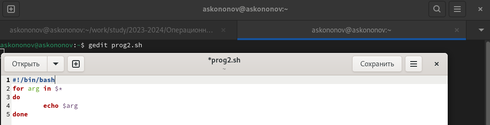

---
## Front matter
title: "Отчёта по лабораторной работе №9:"
subtitle: "Программирование в командном процессоре ОС UNIX. Командные файлы"
author: "Кононов Алексей Сергеевич"

## Generic otions
lang: ru-RU
toc-title: "Содержание"

## Bibliography
bibliography: bib/cite.bib
csl: pandoc/csl/gost-r-7-0-5-2008-numeric.csl

## Pdf output format
toc: true # Table of contents
toc-depth: 2
lof: true # List of figures
fontsize: 12pt
linestretch: 1.5
papersize: a4
documentclass: scrreprt
## I18n polyglossia
polyglossia-lang:
  name: russian
  options:
	- spelling=modern
	- babelshorthands=true
polyglossia-otherlangs:
  name: english
## I18n babel
babel-lang: russian
babel-otherlangs: english
## Fonts
mainfont: PT Serif
romanfont: PT Serif
sansfont: PT Sans
monofont: PT Mono
mainfontoptions: Ligatures=TeX
romanfontoptions: Ligatures=TeX
sansfontoptions: Ligatures=TeX,Scale=MatchLowercase
monofontoptions: Scale=MatchLowercase,Scale=0.9
## Biblatex
biblatex: true
biblio-style: "gost-numeric"
biblatexoptions:
  - parentracker=true
  - backend=biber
  - hyperref=auto
  - language=auto
  - autolang=other*
  - citestyle=gost-numeric
## Pandoc-crossref LaTeX customization
figureTitle: "Рис."
tableTitle: "Таблица"
listingTitle: "Листинг"
lofTitle: "Список иллюстраций"
lolTitle: "Листинги"
## Misc options
indent: true
header-includes:
  - \usepackage{indentfirst}
  - \usepackage{float} # keep figures where there are in the text
  - \floatplacement{figure}{H} # keep figures where there are in the text
---

# Цель работы

Изучить основы программирования в оболочке ОС UNIX/Linux. Научиться писать небольшие командные файлы.

# Задание

1. Написать скрипт, который при запуске будет делать резервную копию самого себя (то есть файла, в котором содержится его исходный код) в другую директорию `backup` в вашем домашнем каталоге. При этом файл должен архивироваться одним из архиваторов на выбор `zip`, `bzip2` или `tar`. Способ использования команд архивации
необходимо узнать, изучив справку.
2. Написать пример командного файла, обрабатывающего любое произвольное число аргументов командной строки, в том числе превышающее десять. Например, скрипт может последовательно распечатывать значения всех переданных аргументов.
3. Написать командный файл — аналог команды `ls` (без использования самой этой команды и команды `dir`). Требуется, чтобы он выдавал информацию о нужном каталоге и выводил информацию о возможностях доступа к файлам этого каталога.
4. Написать командный файл, который получает в качестве аргумента командной строки
формат файла (`.txt`, `.doc`, `.jpg`, `.pdf` и т.д.) и вычисляет количество таких файлов
в указанной директории. Путь к директории также передаётся в виде аргумента командной строки.

# Теоретическое введение

Командный процессор (командная оболочка, интерпретатор команд shell) — это программа, позволяющая пользователю взаимодействовать с операционной системой компьютера. В операционных системах типа UNIX/Linux наиболее часто используются следующие реализации командных оболочек:
  
- оболочка Борна (Bourne shell или sh) — стандартная командная оболочка UNIX/Linux, содержащая базовый, но при этом полный набор функций;

- С-оболочка (или csh) — надстройка на оболочкой Борна, использующая С-подобный синтаксис команд с возможностью сохранения истории выполнения команд;

- оболочка Корна (или ksh) — напоминает оболочку С, но операторы управления программой совместимы с операторами оболочки Борна;

- BASH — сокращение от Bourne Again Shell (опять оболочка Борна), в основе своей совмещает свойства оболочек С и Корна (разработка компании Free Software Foundation).

POSIX (Portable Operating System Interface for Computer Environments) — набор стандартов описания интерфейсов взаимодействия операционной системы и прикладных программ. Стандарты POSIX разработаны комитетом IEEE (Institute of Electrical and Electronics Engineers) для обеспечения совместимости различных UNIX/Linux-подобных операционных систем и переносимости прикладных программ на уровне исходного кода. POSIX-совместимые оболочки разработаны на базе оболочки Корна.

# Выполнение лабораторной работы

1. Напишем скрипт, который при запуске будет делать резервную копию самого себя в другую директорию backup в вашем домашнем каталоге. При этом файл должен архивироваться одним из архиваторов на выбор zip, bzip2 или tar.

Вызваем gedit чтобы создать файл для скрипта `gedit prog1.sh`, и вводим необходимый скрипт (рис. [-@fig:001]): 

{#fig:001 width=100%}

Делаем файл исполняемым `chmod +x prog1.sh` и проверяем скрипт. (рис. [-@fig:002]).

{#fig:002 width=100%}

2. Напишем пример командного файла `gedit prog2.sh`, обрабатывающего любое произвольное число аргументов командной строки. (рис. [-@fig:003]):

{#fig:003 width=100%}

Делаем файл исполняемым и выводим результат. В данном случае, будет выводится последовательность аргументов командной строки (рис. [-@fig:004]).
    
{#fig:004 width=100%}

3. Напишем командный файл — аналог команды ls, который бы выдавал информацию о нужном каталоге и выводил информацию о возможностях доступа к файлам этого каталога (рис. [-@fig:005]):

{#fig:005 width=100%}

Делаем файл исполняемым и выводим результат (рис. [-@fig:006]).
    
{#fig:006 width=100%}

4. Напишем командный файл, который получает в качестве аргумента командной строки формат файла (.txt, .doc, .jpg, .pdf и т.д.) и вычисляет количество таких файлов в указанной директории. Путь к директории также передаётся в виде аргумента командной строки. (рис. [-@fig:007]):
 
{#fig:007 width=100%}

Делаем файл исполняемым и выводим результат (рис. [-@fig:008]).
    
{#fig:008 width=100%}


# Контрольные вопросы

1. **Объясните понятие командной оболочки. Приведите примеры командных оболочек. Чем они отличаются?**

**Командная оболочка** – это интерфейс между пользователем и операционной системой, который позволяет пользователю взаимодействовать с операционной системой путем ввода текстовых команд. Примеры командных оболочек включают Bash (Bourne Again Shell), Zsh (Z Shell), Fish (Friendly Interactive Shell) и другие. Они отличаются по своим возможностям, синтаксису, встроенным функциям и поддерживаемым расширениям.

2. **Что такое POSIX?**

**POSIX** (Portable Operating System Interface) – это семейство стандартов, разработанных для обеспечения совместимости между различными операционными системами Unix. Он определяет общие интерфейсы для программирования на языке C, командной строки и управления файлами.


3. **Как определяются переменные и массивы в языке программирования bash?**

В языке программирования bash переменные определяются путем присваивания значений их именам. Например:

- Переменные: `variable_name=value`
- Массивы: `array_name[index]=value`

4. **Каково назначение операторов let и read?**

**Оператор let** используется для выполнения арифметических выражений в bash. **Оператор read** используется для считывания значений из стандартного ввода и присваивания их переменным.

5. **Какие арифметические операции можно применять в языке программирования bash?**

В языке программирования bash можно применять стандартные арифметические операции, такие как сложение, вычитание, умножение и деление.

6. **Что означает операция (( ))?**

Операция `(( ))` в bash используется для выполнения арифметических вычислений.

7. **Какие стандартные имена переменных Вам известны?**

Некоторые стандартные имена переменных в bash:

- `HOME`: домашний каталог текущего пользователя.
- `PWD`: текущий рабочий каталог.
- `PATH`: список каталогов, в которых операционная система ищет исполняемые файлы.
- `USER`: имя текущего пользователя.

8. **Что такое метасимволы?**

**Метасимволы** – это символы, которые имеют специальное значение в контексте командной строки или шаблонов файлов. Некоторые примеры метасимволов включают `*`, `?`, `[ ]`, `{ }`, `|`, `;` и `&`.

9. **Как экранировать метасимволы?**

Для экранирования метасимволов в bash используется обратная косая черта `\`. Например, чтобы использовать символ `*` как обычный символ, его можно экранировать так: `\*`.

10. **Как создавать и запускать командные файлы?**

Для создания и запуска командных файлов в bash можно использовать текстовый редактор для создания файла с расширением `.sh`, затем присвоить ему права на выполнение с помощью команды `chmod +x filename.sh`, и, наконец, запустить файл с помощью команды `./filename.sh`.

11. **Как определяются функции в языке программирования bash?**

Функции в языке программирования bash определяются с использованием ключевого слова `function` или просто с именем функции, после чего идет блок кода. Например:

``` bash
function my_function {
    # Код функции
    } 
```

12. **Каким образом можно выяснить, является файл каталогом или обычным файлом?**

Для определения, является ли файл каталогом или обычным файлом, можно использовать команду `test`. Например:

- Проверка на каталог: `test -d filename`
- Проверка на обычный файл: `test -f filename`

13. **Каково назначение команд set, typeset и unset?**

**Команды set, typeset и unset** используются для работы с переменными в bash:

- `set`: устанавливает значения и флаги для параметров командной строки.
- `typeset`: используется для объявления переменных с определенными свойствами, такими как readonly или integer.
- `unset`: удаляет значения переменных.

14. **Как передаются параметры в командные файлы?**

Параметры передаются в командные файлы в виде аргументов командной строки. Они доступны внутри скрипта через специальные переменные `$1`, `$2`, `$3` и так далее, где `$1` содержит первый аргумент, `$2` – второй и т.д.

15. **Назовите специальные переменные языка bash и их назначение.**

Некоторые специальные переменные языка bash и их назначение:

- `$0`: имя текущей выполняемой программы.
- `$#`: количество аргументов, переданных скрипту.
- `$?`: код возврата последней выполненной команды.
- `$$`: PID (идентификатор процесса) текущего скрипта.
- `$!`: PID последнего запущенного фонового процесса.

# Выводы

В данной лабораторной работе мы изучили основы программирования в оболочке ОС UNIX/Linux, а также научились писать небольшие командные файлы.

# Список литературы{.unnumbered}

::: {#refs}
:::

