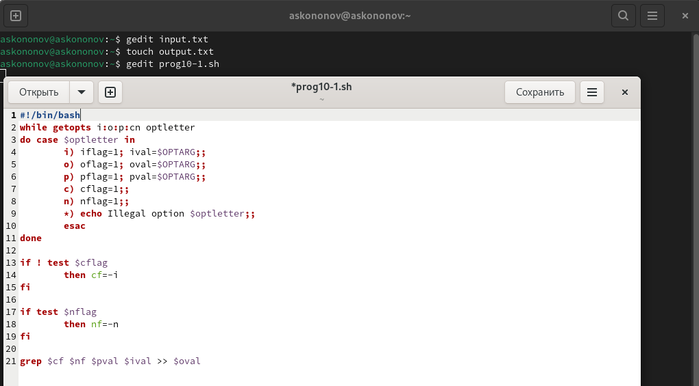
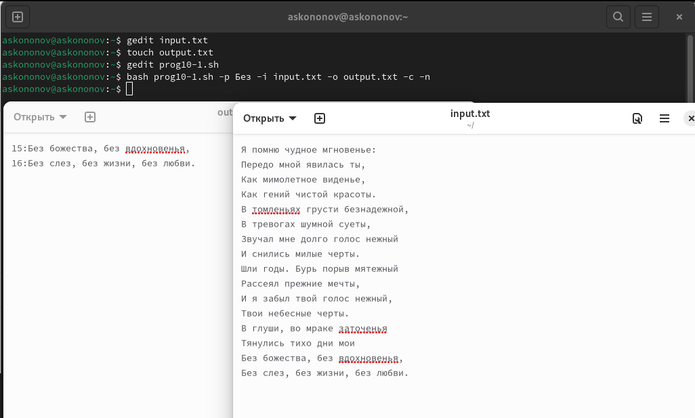
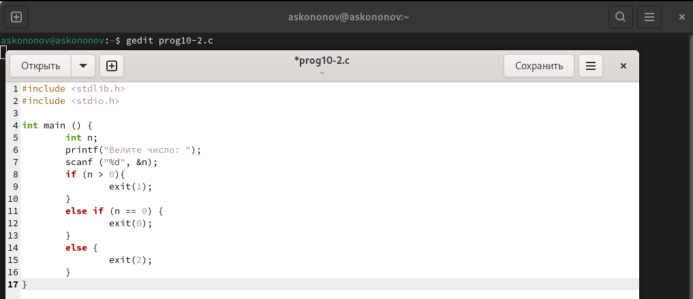
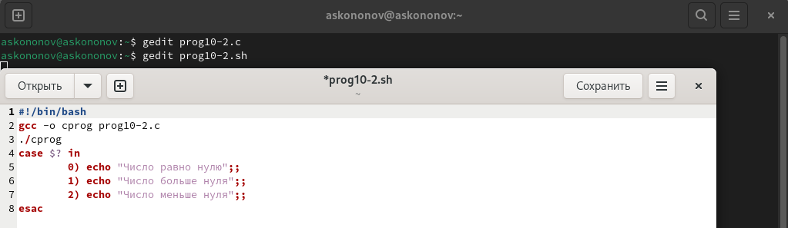
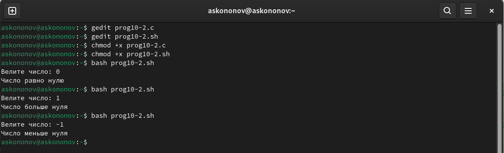
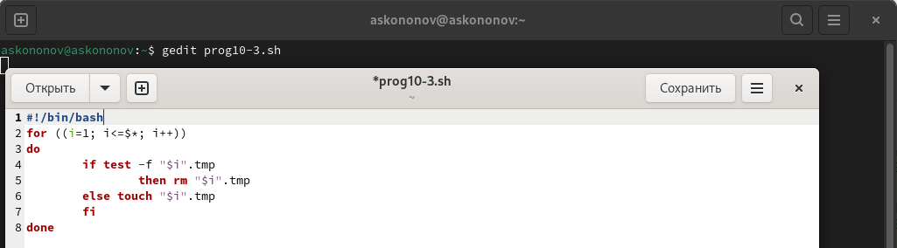
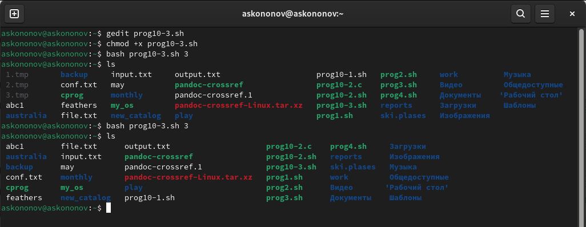
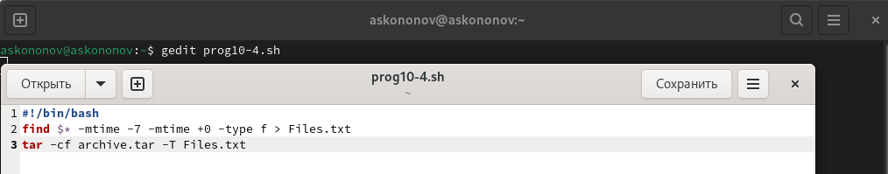
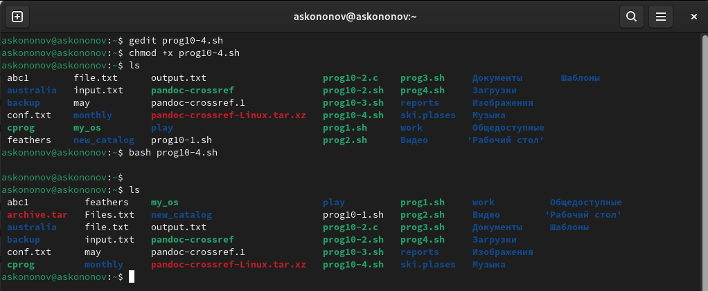

---
## Front matter
title: "Отчёта по лабораторной работе №10:"
subtitle: "Программирование в командном процессоре ОС UNIX. Ветвления и циклы"
author: "Кононов Алексей Сергеевич"

## Generic otions
lang: ru-RU
toc-title: "Содержание"

## Bibliography
bibliography: bib/cite.bib
csl: pandoc/csl/gost-r-7-0-5-2008-numeric.csl

## Pdf output format
toc: true # Table of contents
toc-depth: 2
lof: true # List of figures
fontsize: 12pt
linestretch: 1.5
papersize: a4
documentclass: scrreprt
## I18n polyglossia
polyglossia-lang:
  name: russian
  options:
	- spelling=modern
	- babelshorthands=true
polyglossia-otherlangs:
  name: english
## I18n babel
babel-lang: russian
babel-otherlangs: english
## Fonts
mainfont: PT Serif
romanfont: PT Serif
sansfont: PT Sans
monofont: PT Mono
mainfontoptions: Ligatures=TeX
romanfontoptions: Ligatures=TeX
sansfontoptions: Ligatures=TeX,Scale=MatchLowercase
monofontoptions: Scale=MatchLowercase,Scale=0.9
## Biblatex
biblatex: true
biblio-style: "gost-numeric"
biblatexoptions:
  - parentracker=true
  - backend=biber
  - hyperref=auto
  - language=auto
  - autolang=other*
  - citestyle=gost-numeric
## Pandoc-crossref LaTeX customization
figureTitle: "Рис."
tableTitle: "Таблица"
listingTitle: "Листинг"
lofTitle: "Список иллюстраций"
lolTitle: "Листинги"
## Misc options
indent: true
header-includes:
  - \usepackage{indentfirst}
  - \usepackage{float} # keep figures where there are in the text
  - \floatplacement{figure}{H} # keep figures where there are in the text
---

# Цель работы

Изучить основы программирования в оболочке ОС UNIX. Научится писать более сложные командные файлы с использованием логических управляющих конструкций и циклов.

# Задание

1. Используя команды getopts grep, написать командный файл, который анализирует командную строку с ключами:

- -i - inputfile — прочитать данные из указанного файла;
- -o - outputfile — вывести данные в указанный файл;
- -p - шаблон — указать шаблон для поиска;
- -C — различать большие и малые буквы;
- -n — выдавать номера строк.

а затем ищет в указанном файле нужные строки, определяемые ключом -p.

2. Написать на языке Си программу, которая вводит число и определяет, является ли оно больше нуля, меньше нуля или равно нулю. Затем программа завершается с помощью
функции exit(n), передавая информацию о коде завершения в оболочку. Командный файл должен вызывать эту программу и, проанализировав с помощью команды $?, выдать сообщение о том, какое число было введено.

3. Написать командный файл, создающий указанное число файлов, пронумерованных последовательно от 1 до N (например 1.tmp, 2.tmp, 3.tmp,4.tmp и т.д.). Число файлов, которые необходимо создать, передаётся в аргументы командной строки. Этот же командный файл должен уметь удалять все созданные им файлы (если они существуют).

4. Написать командный файл, который с помощью команды tar запаковывает в архив все файлы в указанной директории. Модифицировать его так, чтобы запаковывались только те файлы, которые были изменены менее недели тому назад (использовать команду find).

# Выполнение лабораторной работы

1. Напишем командный файл getopts grep, который анализирует командную строку с ключами (-i, -o, -p,-c, -n), а затем ищет в указанном файле нужные строки, определяемые ключом -p  (рис. [-@fig:001]):
	
{#fig:001 width=100%}

Делаем текстоовый файл "input.txt" для ввода и "output.txt" для вывода. Делаем файл "prog10-1.sh" исполняемым и выводим результат (рис. [-@fig:002]).

{#fig:002 width=100%}

2. Напишем на языке Си программу, которая вводит число и определяет, является ли оно больше нуля, меньше нуля или равно нулю. Затем программа завершается с помощью
функции exit(n), передавая информацию о коде завершения в оболочку. Командный файл должен вызывать эту программу и, проанализировав с помощью команды $?, выдать сообщение о том, какое число было введено (рис. [-@fig:003]), (рис. [-@fig:004]):

{#fig:003 width=100%}

{#fig:004 width=100%}

Делаем файлы исполняемыми и выводим результат (рис. [-@fig:005]).
    
{#fig:005 width=100%}

3. Напишем командный файл, создающий указанное число файлов, пронумерованных последовательно от 1 до N. Число файлов, которые необходимо создать, передаётся в аргументы командной строки. Этот же командный файл должен уметь удалять все созданные им файлы (рис. [-@fig:006]):
    
{#fig:006 width=100%}

Делаем файлы исполняемыми и выводим результат (рис. [-@fig:007]).
    
{#fig:007 width=100%}

4. Напишем командный файл, который с помощью команды tar запаковывает в архив все файлы в указанной директории. Модифицировать его так, чтобы запаковывались только те файлы, которые были изменены менее недели тому назад, использовав команду find (рис. [-@fig:008]):
  
{#fig:008 width=100%}

Делаем файлы исполняемыми и выводим результат (рис. [-@fig:009]).
    
{#fig:009 width=100%}

# Контрольные вопросы

1. Каково предназначение команды `getopts`?
С помощью `getopts` можно достаточно легко произвести разбор флагов переданных скрипту.
2. Какое отношение метасимволы имеют к генерации имён файлов?
Метасимволы играют важную роль в генерации имен файлов, особенно в командных оболочках _Unix_ и _Linux_. Эти символы представляют собой специальные символы, которые интерпретируются оболочкой для выполнения шаблонного поиска и подстановки. Например:
    - `*` - соответствует любому количеству символов в имени файла.
    - `?` - соответствует ровно одному символу.
    - `[...]` - соответствуют любому одному символу из перечисленных в скобках. 
3. Какие операторы управления действиями вы знаете?
    - Условные операторы:
        - `if`, `elif` и `else` - позволяют выполнять команды, основываясь на условиях.
        - `case` - выбор действий в зависимости от значения переменной.
    - Циклы:
        - `for` - выполняет команды для списка значений.
        - `while` - цикл который выполняется пока условие истинно.
        - `until` - цикл который выполняется пока условие ложно.
4. Какие операторы используются для прерывания цикла?
В Bash для прерывания циклов используются следующие операторы:
    - `break` - прерывает выполнение текущего цикла и передает управление на команду, следующую за циклом. Вы можете указать `break n`, где `n` - это количество уровней цикла, которые нужно прервать.
    - `continue` - пропускает оставшуюся часть тела текущего цикла и переходит к следующей итерации.
Аналогично `break`, можно использовать `continue n` для пропуска итераций во вложенных циклах.
5. Для чего нужны команды `false` и `true`?
Команды `true` и `false` в Bash являются простыми утилитами, которые возвращают статус 
выхода. Они используются в скриптах и условных операторах для управления логикой выполнения.
    - `true` всегда возвращает статус выхода `0`, что означает успех. Эта команда может быть использована в местах, где требуется гарантированно успешный результат, например, в бесконечных циклах `(while true; do ... done)` или как заглушка для функции, которая еще не реализована.
    - `false` всегда возвращает статус выхода `1`, что означает неудачу. Эта команда может быть использована для преднамеренного вызова ошибки или как условие, которое никогда не будет выполнено.
6. Что означает строка `if test -f man$s/$i.$s`, встреченная в командном файле?
В этой строке проверяется существование файла `man$s/$i.$s`, где `$s` и `$i` переменные
подставляющиеся в имя файла.
7. Объясните различия между конструкциями `while` и `until`.
    - `while` --- цикл который выполняется пока условие истинно.
    - `until` --- цикл который выполняется пока условие ложно.

# Выводы

В этой работе мы поближе познакомились с циклами в языке bash. Научились писать более сложные командные файлы
используя логические управляющие конструкции.

# Список литературы{.unnumbered}

::: {#refs}
:::

