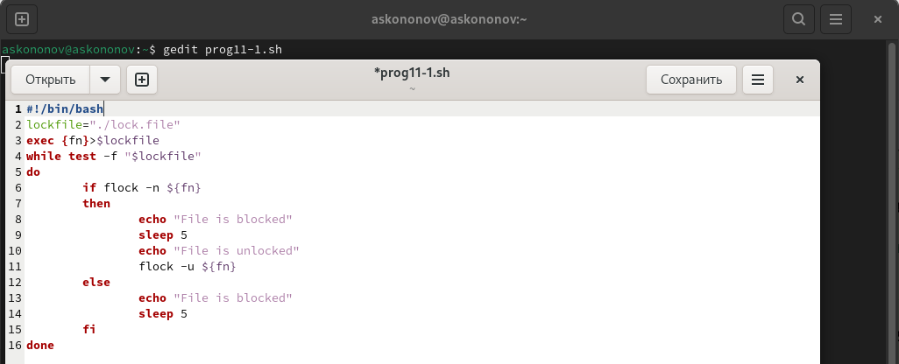
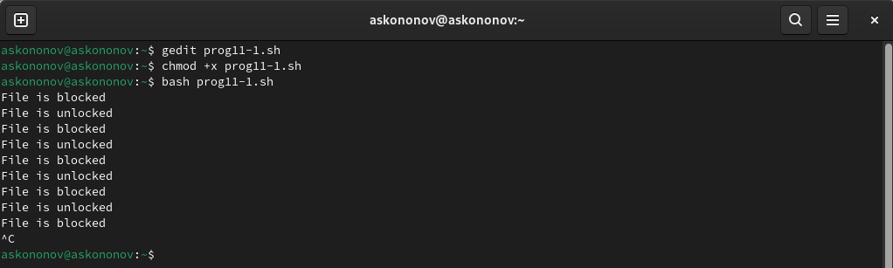
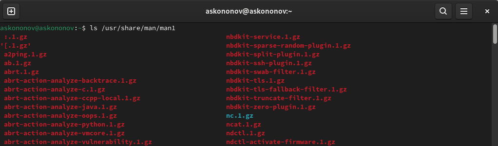
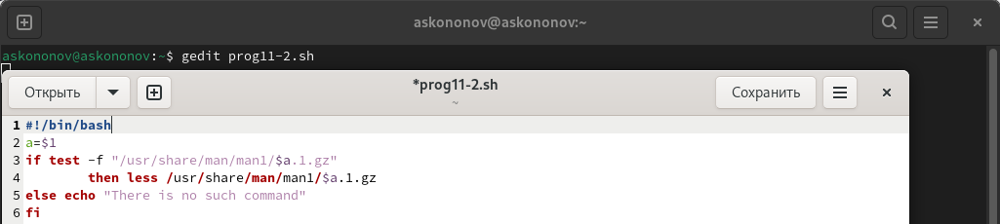
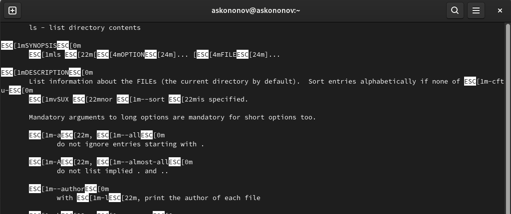
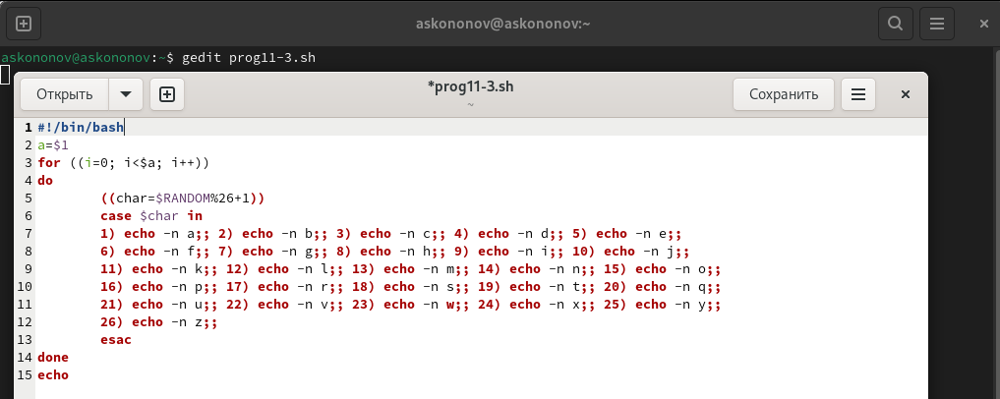
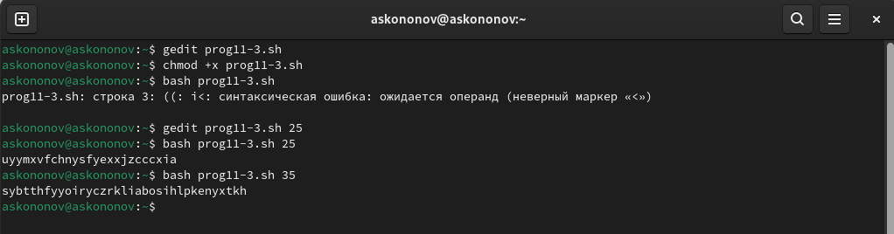

---
## Front matter
title: "Отчёта по лабораторной работе №11:"
subtitle: "Программирование в командном процессоре ОС UNIX. Расширенное программирование"
author: "Кононов Алексей Сергеевич"

## Generic otions
lang: ru-RU
toc-title: "Содержание"

## Bibliography
bibliography: bib/cite.bib
csl: pandoc/csl/gost-r-7-0-5-2008-numeric.csl

## Pdf output format
toc: true # Table of contents
toc-depth: 2
lof: true # List of figures
fontsize: 12pt
linestretch: 1.5
papersize: a4
documentclass: scrreprt
## I18n polyglossia
polyglossia-lang:
  name: russian
  options:
	- spelling=modern
	- babelshorthands=true
polyglossia-otherlangs:
  name: english
## I18n babel
babel-lang: russian
babel-otherlangs: english
## Fonts
mainfont: PT Serif
romanfont: PT Serif
sansfont: PT Sans
monofont: PT Mono
mainfontoptions: Ligatures=TeX
romanfontoptions: Ligatures=TeX
sansfontoptions: Ligatures=TeX,Scale=MatchLowercase
monofontoptions: Scale=MatchLowercase,Scale=0.9
## Biblatex
biblatex: true
biblio-style: "gost-numeric"
biblatexoptions:
  - parentracker=true
  - backend=biber
  - hyperref=auto
  - language=auto
  - autolang=other*
  - citestyle=gost-numeric
## Pandoc-crossref LaTeX customization
figureTitle: "Рис."
tableTitle: "Таблица"
listingTitle: "Листинг"
lofTitle: "Список иллюстраций"
lolTitle: "Листинги"
## Misc options
indent: true
header-includes:
  - \usepackage{indentfirst}
  - \usepackage{float} # keep figures where there are in the text
  - \floatplacement{figure}{H} # keep figures where there are in the text
---

# Цель работы

Изучить основы программирования в оболочке ОС UNIX. Научиться писать более сложные командные файлы с использованием логических управляющих конструкций и циклов.

# Задание

1. Написать командный файл, реализующий упрощённый механизм семафоров. Командный файл должен в течение некоторого времени `t1` дожидаться освобождения ресурса, выдавая об этом сообщение, а дождавшись его освобождения, использовать его в течение некоторого времени `t2<>t1`, также выдавая информацию о том, что ресурс используется соответствующим командным файлом (процессом). Запустить командный файл в одном виртуальном терминале в фоновом режиме, перенаправив его вывод в другой (`> /dev/tty#`, где `#` — номер терминала куда перенаправляется вывод), в котором также запущен этот файл, но не фоновом, а в привилегированном режиме. Доработать программу так, чтобы имелась возможность взаимодействия трёх и более процессов.

2. Реализовать команду `man` с помощью командного файла. Изучите содержимое каталога `/usr/share/man/man1`. В нем находятся архивы текстовых файлов, содержащих справку по большинству установленных в системе программ и команд. Каждый архив можно открыть командой `less` сразу же просмотрев содержимое справки. Командный файл должен получать в виде аргумента командной строки название команды и в виде результата выдавать справку об этой команде или сообщение об отсутствии справки, если соответствующего файла нет в каталоге `man1`.

3. Используя встроенную переменную `$RANDOM`, напишите командный файл, генерирующий случайную последовательность букв латинского алфавита. Учтите, что `$RANDOM` выдаёт псевдослучайные числа в диапазоне от `0` до `32767`.

# Выполнение лабораторной работы

1. Напишем командный файл, реализующий упрощённый механизм семафоров. Командный файл должен в течение некоторого времени `t1` дожидаться освобождения ресурса, выдавая об этом сообщение, а дождавшись его освобождения, использовать его в течение некоторого времени `t2<>t1`, также выдавая информацию о том, что ресурс используется соответствующим командным файлом (процессом). Запустить командный файл в одном виртуальном терминале в фоновом режиме, перенаправив его вывод в другой (`> /dev/tty#`, где `#` — номер терминала куда перенаправляется вывод), в котором также запущен этот файл, но не фоновом, а в привилегированном режиме. Доработать программу так, чтобы имелась возможность взаимодействия трёх и более процессов. (рис. [-@fig:001]):
	
{#fig:001 width=100%}

Делаем файлы исполняемыми и выводим результат (рис. [-@fig:002]).

{#fig:002 width=100%}

2. Реализуем команду `man` с помощью командного файла. Изучите содержимое каталога `/usr/share/man/man1`. В нем находятся архивы текстовых файлов, содержащих справку по большинству установленных в системе программ и команд. Каждый архив можно открыть командой `less` сразу же просмотрев содержимое справки. Командный файл должен получать в виде аргумента командной строки название команды и в виде результата выдавать справку об этой команде или сообщение об отсутствии справки, если соответствующего файла нет в каталоге `man1`. (рис. [-@fig:004]):

{#fig:003 width=100%}

{#fig:004 width=100%}

Делаем файлы исполняемыми и проверяем работу программы, запросив справку о команде `ls` (рис. [-@fig:005]) 

{#fig:005 width=100%}

В итоге мы получаем справку команды `ls`, которую запрашивали (рис. [-@fig:006]).
    
{#fig:006 width=100%}

3. Используя встроенную переменную `$RANDOM`, напишем командный файл, генерирующий случайную последовательность букв латинского алфавита. (рис. [-@fig:007]):
    
{#fig:007 width=100%}

Делаем файлы исполняемыми и выводим результат (рис. [-@fig:008]).
    
{#fig:008 width=100%}

# Контрольные вопросы

1. Найдите синтаксическую ошибку в следующей строке:
`while [$1 != "exit"]`
Ошибка в том что после `[` и до `]` должен идти пробел, еще имеет смысл обернуть `$1` в двойные кавычки, чтобы эта переменная корректно обрабатывалась даже если она содержит пробелы.
2. Как объединить (конкатенировать) несколько строк в одну?
Есть множество способов конкатенации строк в bash, я разберу два основных.
Предположим у нас есть переменные `a` и `b`, чтобы добавить к строке `a` строку `b` справа можно использовать следующий синтаксис: `a+=$b`. Записать результат конкатенации в новую переменную можно так: `c="$a$b"`.
3. Найдите информацию об утилите `seq`. Какими иными способами можно реализовать её функционал при программировании на bash?
Утилита `seq` используется для генерации последовательностей, ее можно использовать в циклах. 
Например: `for i in $(seq 0 2 10)`, переменная `i` будет принимать значения от `0` до `10` включительно с шагом `2`.
Очевидно, что чтобы добиться похожего результата можно использовать Си-подобный цикл `for`: `for ((i=0;i<=10;i+=2))`
4. Какой результат даст вычисление выражения `$((10/3))?`
Результат будет `3`, так как будет выполнено целочисленное деление.
5. Укажите кратко основные отличия командной оболочки zsh от bash.
    - Интерактивность: zsh известен своими улучшенными интерактивными возможностями, такими как более продвинутый автодополнение команд и файлов, что делает его более удобным для интерактивного использования.
    - Темы и плагины: zsh поддерживает темы и плагины, что позволяет пользователям настраивать свой рабочий интерфейс и расширять функциональность оболочки.
    - Синтаксис: zsh обладает более гибким синтаксисом, включая улучшенные возможности для работы с массивами и ассоциативными массивами.
    - Совместимость: zsh во многом совместим с bash, но включает множество дополнительных возможностей, которые могут не работать в bash без изменений.
    - Контекстное автодополнение: zsh предлагает более продвинутое контекстное автодополнение, которое может учитывать не только имена файлов и команд, но и их параметры.
    - Модульность: zsh разработан с учётом модульности, что позволяет легко добавлять новые функции и интегрировать внешние скрипты.
6. Проверьте, верен ли синтаксис данной конструкции\
`for ((a=1; a <= LIMIT; a++))`
Да, синтаксис верен. В двойных круглых скобках можно использовать переменные без знака доллара.
7. Сравните язык bash с какими-либо языками программирования. 
Какие преимущества у bash по сравнению с ними? Какие недостатки?
    - Преимущества bash:
        - Скорость разработки: bash-скрипты обычно проще и быстрее писать для простых задач, особенно для автоматизации командной строки и системных операций.
        - Встроенная поддержка UNIX-команд: bash нативно интегрируется с UNIX-командами и утилитами, что делает его мощным инструментом для системного администрирования.
        - Портативность: bash-скрипты легко переносить между различными UNIX-подобными системами без изменений.
    - Недостатки bash:
        - Ограниченные возможности программирования: bash не имеет такого богатого набора функций программирования, как C++ или Python, например, объектно-ориентированное программирование или обширные стандартные библиотеки.
        - Медленная производительность: Для сложных задач или задач, требующих интенсивных вычислений, bash может работать медленнее, чем C++ или Python.
        - Сложность синтаксиса: Некоторые аспекты синтаксиса bash могут быть непривычными или запутаннымидля новичков, особенно при работе с текстовыми строками и файлами.

# Выводы

В этой лабораторной работе мы закрепили свои знания об основах программирования на языке bash.
Написав простейшие реализации семафора и команды `man`, использовав переменную `$RANDOM` для генерации последовательности букв английского алфавита.

# Список литературы{.unnumbered}

::: {#refs}
:::

